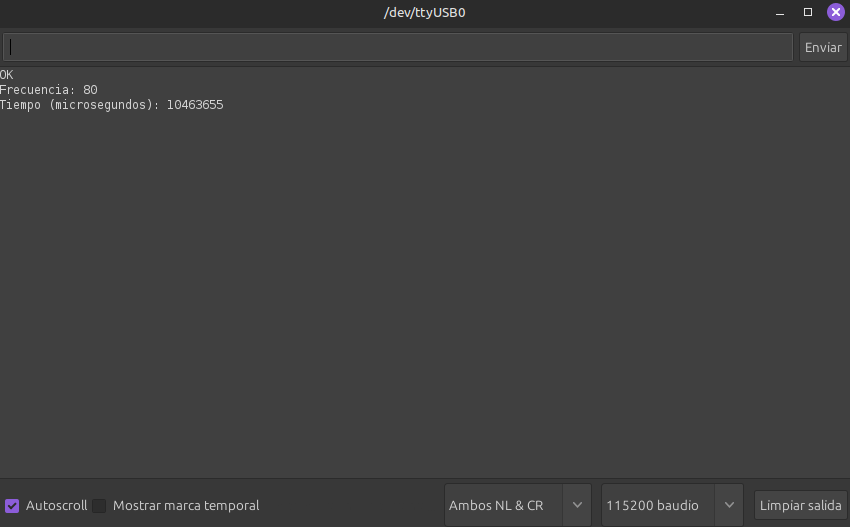
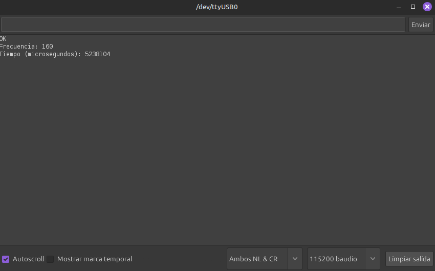

# Trabajo Práctico 1 - Rendimiento de las Computadoras

## Integrantes

- Santiago Alasia
- Lucia Feiguin
- Elena Monutti

## Objetivo

El objetivo de este trabajo práctico es poner en práctica los conceptos vistos sobre **performance** y **rendimiento de las computadoras**.

El trabajo se divide en dos partes. En la primera, se analizan **benchmarks de terceros** para evaluar qué pruebas resultan más útiles según las tareas que realiza cada usuario y para comparar el rendimiento de distintos procesadores en la compilación del kernel de Linux. En la segunda parte, se utilizan herramientas de **time profiling** para medir la performance de un programa y observar cuánto tiempo consume cada función.

## 1. Benchmarks útiles según las tareas diarias

### 1.1 ¿Qué es un benchmark?

Un **benchmark** es una prueba diseñada para medir el rendimiento de un sistema frente a una tarea específica. En computación, se utilizan benchmarks para evaluar cómo se comporta un procesador, memoria o sistema completo al ejecutar ciertos programas.
No existe un único benchmark que represente todos los casos de uso. El rendimiento de un sistema depende del tipo de tarea que se esté ejecutando, por lo que el benchmark más útil será aquel que mejor represente las actividades reales del usuario.

### 1.2 ¿Qué benchmarks son más útiles según el uso?

Los benchmarks más útiles dependen directamente del tipo de tareas que realiza cada usuario en su día a día. Esto se debe a que el rendimiento no es una propiedad absoluta, sino relativa a la carga de trabajo.
En el caso de estudiantes o desarrolladores, las tareas más comunes incluyen:
- Compilar programas
- Ejecutar código
- Manejar repositorios
- Trabajar con archivos
Por lo tanto, los benchmarks que mejor representan este tipo de uso son aquellos relacionados con compilación, procesamiento de datos y operaciones sobre archivos.

### 1.3 Lista de benchmarks útiles

- **Build Linux Kernel**  
  Representa tareas de compilación intensiva. 
- **Build GCC / Build LLVM**  
  Simulan la compilación de proyectos grandes y complejos.
- **Git Benchmark**  
  Evalúa el rendimiento al trabajar con repositorios y control de versiones.
- **Compression (gzip, zstd, xz, 7zip)**  
  Representa tareas de compresión y descompresión de archivos.
- **FFmpeg / x264 / x265**  
  Utilizados para procesamiento y codificación de video.
- **Blender**  
  Benchmark de renderizado 3D.
- **OpenSSL / GnuPG**  
  Evalúan operaciones criptográficas.
- **SQLite / pgbench**  
  Representan cargas de trabajo con bases de datos.
- **TensorFlow Lite / oneDNN**  
  Utilizados para tareas de inteligencia artificial en CPU.

### 1.4 Tabla: tareas diarias y benchmark asociado

| Tarea diaria | Benchmark representativo | Justificación |
|---|---|---|
| Compilar programas en C/C++ | Build Linux Kernel | Representa una tarea real de compilación intensiva |
| Compilar proyectos grandes | Build GCC / LLVM | Simula compilaciones complejas |
| Trabajar con repositorios | Git Benchmark | Representa operaciones reales sobre archivos |
| Comprimir archivos | gzip / zstd / xz | Refleja tareas comunes del sistema |
| Procesar videos | FFmpeg / x264 | Simula carga multimedia |
| Renderizar gráficos | Blender | Representa renderizado 3D |
| Trabajar con bases de datos | pgbench / SQLite | Simula consultas y manejo de datos |
| Ejecutar modelos de IA | TensorFlow Lite | Representa procesamiento intensivo en CPU |

### 1.5 Conclusión

Los benchmarks son herramientas fundamentales para evaluar el rendimiento de un sistema, pero su utilidad depende del contexto. No existe una única prueba que represente todos los usos posibles.
Para obtener resultados significativos, es importante elegir benchmarks que reflejen las tareas reales del usuario. En este caso, para un perfil orientado a la programación, los benchmarks de compilación resultan especialmente representativos.

## 2. Comparación de procesadores compilando el kernel de Linux

### 2.1 Objetivo de la comparación

En esta sección se compara el rendimiento de distintos procesadores utilizando un benchmark real: la compilación del kernel de Linux.
Este tipo de prueba es especialmente relevante porque representa una carga de trabajo intensiva en CPU, donde intervienen múltiples factores como:
- Cantidad de núcleos
- Frecuencia del procesador
- Capacidad de paralelismo
El benchmark utilizado mide el **tiempo necesario para compilar el kernel**, por lo tanto, **menor tiempo implica mejor rendimiento**.

### 2.2 Procesadores analizados

Los procesadores evaluados en este trabajo son:
- Intel Core i5-13600K
- AMD Ryzen 9 5900X (12 núcleos)
- AMD Ryzen 9 7950X (16 núcleos)

### 2.3 Resultados del benchmark

Se utilizaron datos del benchmark **Build Linux Kernel**, que mide el tiempo de compilación del kernel de Linux.
| Procesador | Tiempo de compilación (segundos) |
|---|---:|
| Intel Core i5-13600K | 72 s |
| AMD Ryzen 9 5900X | 76 s |
| AMD Ryzen 9 7950X | 50 s |

A partir de los resultados se puede observar que:
- El **AMD Ryzen 9 7950X** presenta el mejor rendimiento, con el menor tiempo de compilación.
- El **Intel Core i5-13600K** tiene un rendimiento ligeramente superior al Ryzen 9 5900X en esta prueba.
- El **Ryzen 9 5900X** queda en último lugar entre los tres, aunque la diferencia con el i5 no es muy grande.
Esto demuestra que el rendimiento no depende únicamente de la cantidad de núcleos, sino también de la arquitectura y optimización del procesador.

### 2.4 Cálculo de aceleración (Speedup)

La aceleración o *speedup* se calcula como:
Speedup = Tiempo base / Tiempo mejorado

#### Comparación con Intel Core i5-13600K

Speedup = 72 / 50 = 1.44
El Ryzen 9 7950X es aproximadamente **1.44 veces más rápido** que el i5-13600K.

#### Comparación con AMD Ryzen 9 5900X

Speedup = 76 / 50 = 1.52
El Ryzen 9 7950X es aproximadamente **1.52 veces más rápido** que el Ryzen 9 5900X.

Estos resultados indican una mejora significativa en el tiempo de ejecución al utilizar el Ryzen 9 7950X.
Sin embargo, la aceleración no es proporcional a la cantidad de núcleos, lo cual se debe a limitaciones como:
- Overhead de paralelismo
- Partes del código que no pueden paralelizarse
- Diferencias en arquitectura
Esto coincide con el concepto de que no todo el programa puede ejecutarse en paralelo de manera perfecta.

## 3. Time Profiling

### 3.1 Objetivo

En esta sección se analiza el rendimiento de un programa propio utilizando herramientas de time profiling. A diferencia de los benchmarks, que miden el rendimiento global del sistema, el profiling permite observar cuánto tiempo consume cada función dentro de un programa.

Esto permite identificar posibles cuellos de botella y entender mejor cómo se distribuye el tiempo de ejecución.

### 3.2 Resultados del Profiling

Se utilizó la herramienta gprof para analizar el tiempo de ejecución del programa. A partir del archivo generado (`analysis.txt`), se obtuvo el perfil plano (flat profile), que muestra cómo se distribuye el tiempo entre las distintas funciones. El mismo se encuentra a continuación.

```
   %   cumulative   self              self     total           
  time   seconds   seconds    calls   s/call   s/call  name    
 51.07      4.52     4.52        1     4.52     4.82  func1
 42.71      8.30     3.78        1     3.78     3.78  func2
  3.39      8.60     0.30        1     0.30     0.30  new_func1
  2.82      8.85     0.25                             main
```

Los resultados indican que la función `func1` consume el mayor porcentaje del tiempo de ejecución, aproximadamente un 51.07% del total. En segundo lugar se encuentra `func2`, con un 42.71%, mientras que `new_func1` y main` representan una porción mucho menor del tiempo total.

Todas las funciones fueron ejecutadas una punica vez, lo cual se observa en la columna calls. La diferencia en los tiempos se debe principalmente a la cantidad de iteraciones de los bucles presentes en cada función. En particular, `func1` no solo realiza un bucle de gran tamaño, sino que además invoca a `new_func1`, lo que incrementa su tiempo total de ejecución.

### 3.3 Análisis del gráfico de llamadas

Se obtuvo el siguiente call graph:

```
index % time    self  children    called     name
                                                 <spontaneous>
[1]    100.0    0.25    8.60                 main [1]
                4.52    0.30       1/1           func1 [2]
                3.78    0.00       1/1           func2 [3]
-----------------------------------------------
                4.52    0.30       1/1           main [1]
[2]     54.5    4.52    0.30       1         func1 [2]
                0.30    0.00       1/1           new_func1 [4]
-----------------------------------------------
                3.78    0.00       1/1           main [1]
[3]     42.7    3.78    0.00       1         func2 [3]
-----------------------------------------------
                0.30    0.00       1/1           func1 [2]
[4]      3.4    0.30    0.00       1         new_func1 [4]
```

El gráfico de llamadas (call graph) permite observar la relación entre las funciones. En este caso, la función `main` es la encargada de invocar a `func1`y `func2`, mientras que `func1`a su vez llama a `new_func1`.

Este comportamiento explica la propagación del tiempo de ejecución, ya que parte del tiempo de `func1` incluye el tiempo consumido por `new_func1`. Esto se refleja en la columna children del análisis.

### 3.4 Conclusión del profiling

A partir del análisis realizado, se concluye que la función `func1` constituye el principal cuello de botella del programa. Esto coincide con la estructura del código, ya que contiene el bucle más costoso y además invoca a otra función. 

El uso de herramientas de profiling como gprof permite identificar con precisión qué partes del código consumen más tiempo, lo cual es fundamental para optimizar programas y mejorar su rendimiento.

## 4. Ejercicio Con ESP8266

### 4.1 Objetivo

En esta sección se busca poner en práctica los conocimientos teóricos utilizando el microcontrolador **ESP8266**. El objetivo del ejercicio consiste en ejecutar un programa que realiza operaciones simples (sumas de números enteros y de punto flotante) durante un tiempo aproximado de 10 segundos a una determinada frecuencia de reloj del procesador.

Posteriormente, se analiza cómo afecta la variación de la **frecuencia del CPU** (duplicar) sobre el tiempo de ejecución del programa.

Para el desarrollo del ejercicio se utilizó el entorno de desarrollo Arduino IDE, debido a su compatibilidad con el ESP8266 y la facilidad que brinda para la carga y ejecución de programas en este tipo de dispositivos.

### 4.2 Resultados

Una vez cargado el programa (ubicado en el directorio `The-Pipeliners/TP1/ESP8266/main`), se pueden observar el siguiente resultado a través del monitor serial.

En la primera prueba, el microcontrolador opera a una frecuencia de **80 MHz**. En estas condiciones, el tiempo de ejecución del programa es de aproximadamente 10,5 segundos, como se muestra en la siguiente imagen:



A continuación, se procede a duplicar la **frecuencia del procesador** a **160 MHz** y se repite la ejecución del mismo programa.



Como se puede observar, el tiempo de ejecución se reduce aproximadamente a la mitad. Este comportamiento indica una **mejora en el rendimiento del sistema** al aumentar la **frecuencia del clock del procesador**.

### 4.3 Análisis

El resultado obtenido es consistente con el modelo teórico, donde el tiempo de ejecución de un programa puede expresarse como:

Al duplicar la frecuencia del procesador, se incrementa la cantidad de instrucciones que pueden ejecutarse por unidad de tiempo, lo que produce una disminución proporcional en el tiempo total de ejecución.

Cabe destacar que la reducción no es exactamente del 50%.

### 4.4 Conclusión

A partir del experimento realizado, se concluye que existe una relación inversamente proporcional entre la **frecuencia del procesador** y el **tiempo de ejecución de un programa**.

El aumento de la **frecuencia de clock** permite mejorar el **rendimiento del sistema**, reduciendo el tiempo necesario para completar una misma tarea. Sin embargo, en sistemas reales, esta relación puede no ser perfectamente lineal debido a distintos factores internos del hardware y del entorno de ejecución.

Este ejercicio permitió verificar experimentalmente los conceptos teóricos vinculados al **rendimiento** de los procesadores y la influencia de la frecuencia de operación sobre el **tiempo de ejecución**.

---

## Conclusión general

A lo largo de este trabajo se pudo observar cómo diferentes herramientas y metodologías permiten analizar el rendimiento de sistemas computacionales desde distintas perspectivas. En primer lugar, los benchmarks demostraron que la evaluación del desempeño depende del tipo de tareas que realiza el usuario; no existe una prueba única que refleje todos los usos posibles, y para perfiles orientados a la programación, los tests de compilación resultan especialmente representativos. Por otra parte, la comparación de procesadores al compilar el kernel de Linux evidenció que el rendimiento no solo depende de la cantidad de núcleos, sino también de la arquitectura y optimización de cada CPU, reflejándose en diferencias de tiempo de compilación y aceleración significativa en modelos más potentes. El análisis mediante profiling permitió identificar cuellos de botella dentro de un programa, destacando la importancia de medir el tiempo de ejecución de cada función para optimizar el código. Finalmente, el ejercicio con el ESP8266 confirmó experimentalmente que el tiempo de ejecución de un programa disminuye al aumentar la frecuencia del procesador, mostrando una relación inversamente proporcional entre frecuencia y duración de la tarea. En conjunto, estas experiencias evidencian que el rendimiento de un sistema es multidimensional y que su análisis requiere tanto herramientas globales como detalladas para comprender y optimizar eficazmente la performance.