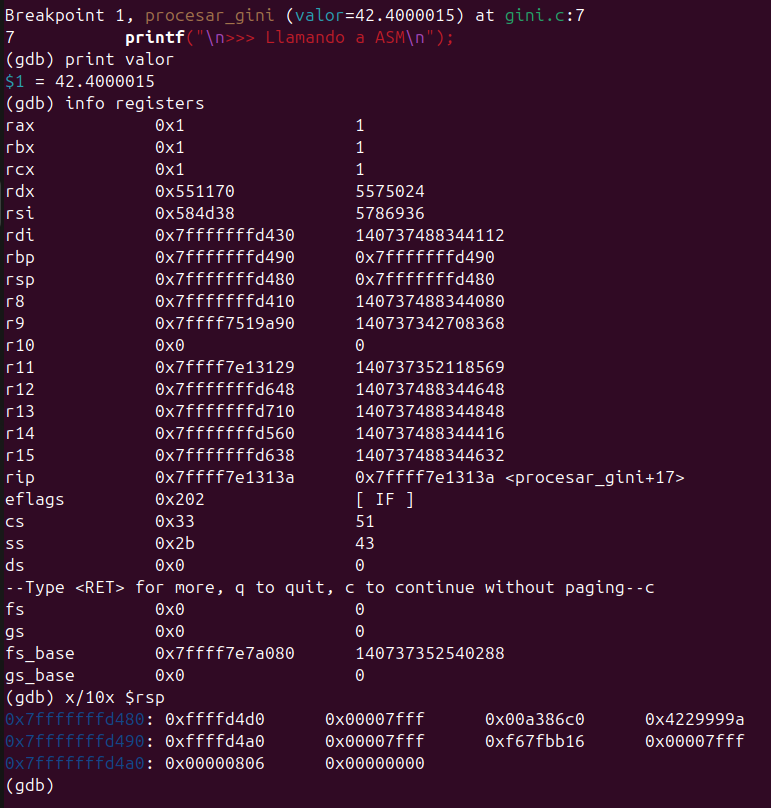
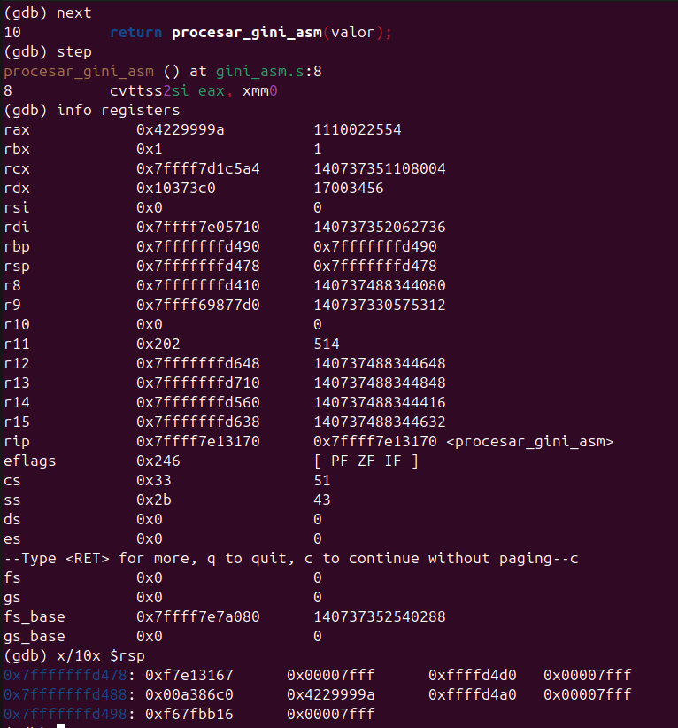
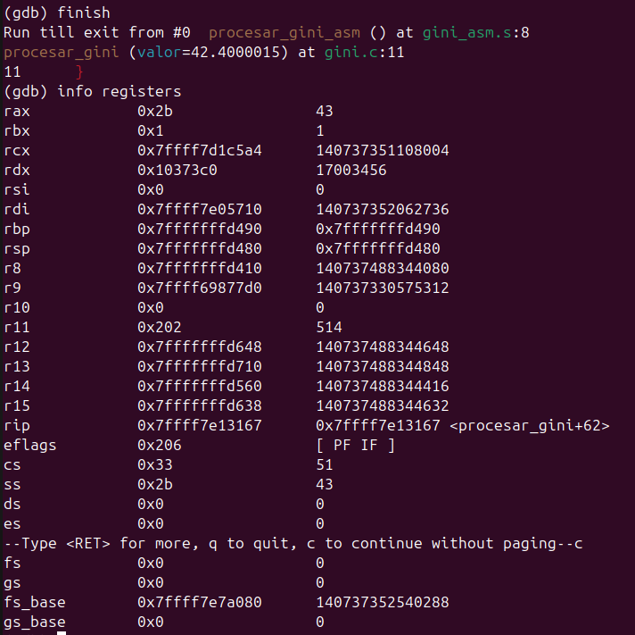

# Trabajo Práctico 2 - Stack Frame

## Integrantes

- Santiago Alasia
- Lucia Feiguin
- Elena Monutti

## Introducción
El presente trabajo práctico tiene como objetivo explorar la interacción entre distintos niveles de abstracción en sistemas computacionales, integrando lenguajes de alto nivel con programación de bajo nivel.

Se implementa una solución que obtiene datos reales desde una API REST (índice de GINI del Banco Mundial), los procesa en distintas capas del sistema y delega la parte de cálculo a rutinas escritas en lenguaje ensamblador. Este enfoque permite evidenciar cómo los lenguajes de alto nivel dependen de mecanismos de bajo nivel para ejecutar operaciones sobre el hardware. 

## Objetivos 
- Comprender la arquitectura en capas de un sistema
- Implementar consumo de datos desde una API REST
- Integrar Python con C mediante librerías compartidas
- Aplicar convenciones de llamadas entre C y ensamblador
- Utilizar el stack para el pasaje de parámetros y retorno de valores
- Implementar y ejecutar rutinas en ensamblador dentro de un flujo real de aplicación

### 1. Primera instancia del proyecto
En la primera versión del trabajo se implementó una solución basada en Python y C.

Python se encarga de la obtención de datos desde la API del Banco Mundial, mientras que el procesamiento del valor se delega a una función implementada en C mediante el uso de una biblioteca compartida.

Esta versión permitió validar:
- La correcta comunicación con la API.
- La integración entre Python y C.
- La lógica general del flujo del sistema.

Sin embargo, no incluía aún interacción con lenguaje ensamblador.

### 2. Segunda instancia del proyecto
En la segunda versión se extendió la implementación existente incorporando una capa adicional en lenguaje ensamblador.

Python delega el procesamiento del valor obtenido a una función en C, la cual actúa como intermediaria y llama a una rutina en ensamblador. Esta integración se realiza mediante el uso de ctypes, permitiendo cargar dinámicamente la biblioteca compartida generada (libgini.so).

La rutina en ensamblador:

- Recibe un valor flotante (desde xmm0).
- Lo convierte a entero.
- Realiza una operación simple (+1).
- Devuelve el resultado al programa en C.

Este cambio introduce:

- Uso de convenciones de llamadas (System V ABI).
- Manejo explícito de registros.
- Interacción directa con el hardware a través de ASM.

Además, se incorporó Docker para estandarizar el entorno de ejecución y simplificar la compilación del sistema.

### 3. Análisis con GDB

Se estableció un breakpoint en la función `procesar_gini` para analizar el estado del sistema antes de la llamada a la rutina en ensamblador.

Se verifica que el valor del índice Gini (42.4) es recibido correctamente como parámetro.

De acuerdo con la convención de llamadas System V en arquitecturas x86_64, este tipo de dato se pasa mediante registros de punto flotante, particularmente `xmm0`.

Además, se inspecciona el stack a través del registro `rsp`, observándose direcciones de memoria correspondientes al contexto de ejecución y a la llamada de funciones.

Se accede a la función `procesar_gini_asm`, implementada en lenguaje ensamblador.

En esta etapa se observa la instrucción `cvttss2si`, la cual convierte un valor de punto flotante a entero.

Según la convención de llamadas System V en arquitecturas x86_64, el valor es recibido a través del registro `xmm0`, mientras que el resultado de la operación se almacena en el registro `eax`.

Asimismo, se inspecciona el stack mediante el registro `rsp`, donde se visualizan direcciones de memoria asociadas al flujo de ejecución y retorno de la función.

Luego de la ejecución de la rutina en ensamblador, el flujo retorna a la función en C.

Se observa que el resultado de la operación (43) es devuelto a través del registro `rax` (equivalente a eax en 32 bits), conforme a la convención de llamadas System V.

Esto permite que el valor sea utilizado posteriormente por el programa en niveles superiores.

---

## Conclusión general

El desarrollo del trabajo permitió comprender de manera práctica cómo se integran distintos niveles de abstracción dentro de un sistema.

Se evidenció que, si bien los lenguajes de alto nivel simplifican el desarrollo, dependen de mecanismos de bajo nivel para ejecutar operaciones concretas. La utilización de ensamblador permitió profundizar en conceptos como registros, stack y convenciones de llamada. 

Además, la separación entre versiones facilitó validar progresivamente la solución, comenzando por la obtención de datos y finalizando con su procesamiento a nivel de hardware. 
