# Trabajo Práctico 3.a - UEFI
## Integrantes

- Santiago Alasia
- Lucia Feiguin
- Elena Monutti

## Link del Repositorio

```
https://github.com/SantiagoAlasia/The-Pipeliners/tree/main/TP3.a
```

## Introducción

La Interfaz de Firmware Extensible Unificada (UEFI) representa una evolución significativa respecto al BIOS tradicional, proporcionando un entorno más flexible, modular y seguro para la inicialización del sistema. A diferencia del modelo legacy, UEFI opera como una capa intermedia entre el hardware y el sistema operativo, ofreciendo servicios estandarizados para la gestión de dispositivos, memoria y arranque.

En el contexto de la ciberseguridad, este entorno resulta especialmente relevante, ya que permite la ejecución de código en etapas tempranas del proceso de arranque, incluso antes de que el sistema operativo tome el control. Esto lo convierte en un punto crítico tanto para el desarrollo de soluciones legítimas como para la posible implementación de amenazas avanzadas, como los bootkits.

En este trabajo se explora el funcionamiento del entorno UEFI mediante el uso de herramientas de emulación, el desarrollo de aplicaciones nativas y su posterior ejecución en hardware real, permitiendo analizar tanto su arquitectura como sus implicancias en términos de seguridad.

## Objetivos 
Comprender la arquitectura de la Interfaz de Firmware Extensible Unificada (UEFI) como un entorno pre-sistema operativo, desarrollar binarios nativos, entender su formato y ejecutar rutinas tanto en entornos emulados como en hardware físico (bare metal).

## 1. Exploración del entorno UEFI y la SHELL

### 1.1 Arranque en el entorno virtual

Se ejecutó el emulador QEMU utilizando el firmware UEFI provisto por OVMF, lo que permite simular un entorno pre-sistema operativo moderno en lugar del BIOS tradicional.

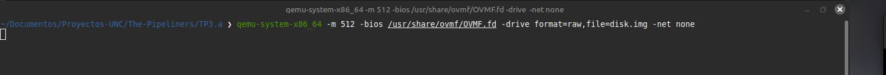

Al iniciar, el sistema carga la UEFI Shell, la cual provee una interfaz interactiva para explorar dispositivos, memoria y ejecutar aplicaciones EFI.

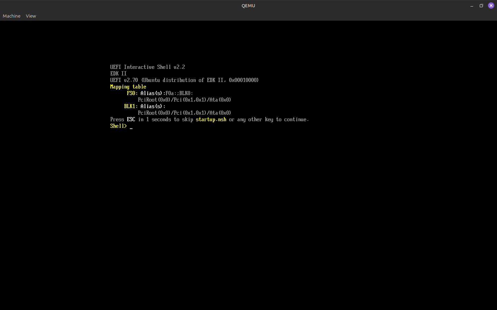

### 1.2 Exploración de dispositivos (Handles y Protocolos)

Se utilizó el comando map para identificar los dispositivos disponibles en el sistema, observándose la asignación de identificadores como FS0.
Posteriormente, se accedió al sistema de archivos mediante fs0: y se listaron sus contenidos con ls, verificando la presencia de archivos en el entorno UEFI.

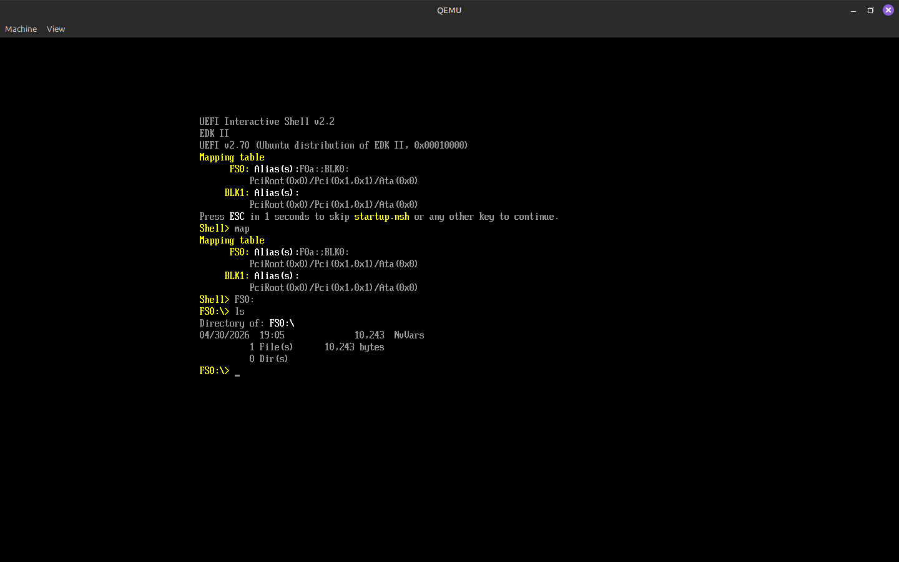

Mediante el comando dh, se visualizaron los distintos handles y protocolos cargados por el firmware, evidenciando el modelo de abstracción de hardware utilizado por UEFI.

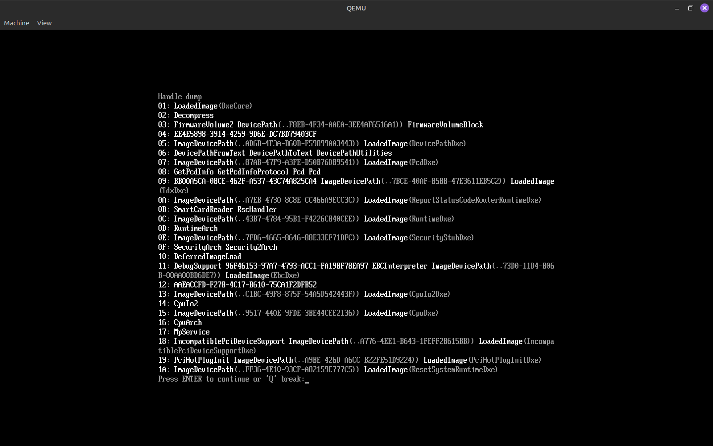

**Pregunta 1: Al ejecutar `map` y `dh`, vemos protocolos e identificadores en lugar de puertos de hardware fijos. ¿Cuál es la ventaja de seguridad y compatibilidad de este modelo frente al antiguo BIOS?**

El modelo de UEFI basado en *handles* y *protocolos* abstrae completamente el acceso al hardware, a diferencia del BIOS tradicional que dependía de direcciones físicas y dispositivos específicos.

Desde el punto de vista de la **compatibilidad**, esto permite que el mismo software funcione en distintas plataformas sin necesidad de conocer detalles del hardware subyacente, ya que interactúa mediante interfaces estandarizadas (protocolos) en lugar de acceder directamente a registros o puertos.

En términos de **seguridad**, esta abstracción reduce la superficie de ataque, ya que evita el acceso directo y arbitrario al hardware. Además, el uso de identificadores únicos (GUIDs) para los protocolos permite un control más preciso sobre qué servicios están disponibles y quién puede utilizarlos, facilitando la validación y el aislamiento de componentes.

En contraste, el BIOS legacy estaba fuertemente acoplado al hardware, lo que lo hacía más difícil de mantener, menos portable y más vulnerable a manipulaciones de bajo nivel.

### 1.3 Análisis de Variables Globales (NVRAM)

Se utilizó el comando dmpstore para inspeccionar las variables persistentes almacenadas en la NVRAM. En particular, se observaron variables como BootOrder y Boot####, las cuales determinan la secuencia de arranque del sistema.

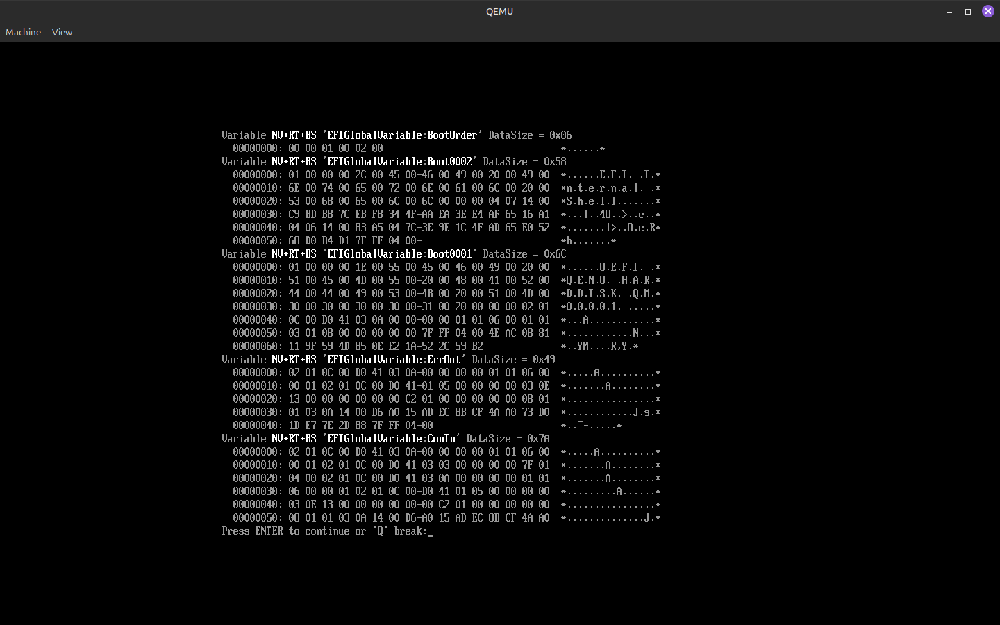

Se creó una variable personalizada (TestSeguridad) utilizando el comando set, verificando posteriormente su almacenamiento mediante la visualización de variables activas.

Esto demuestra la capacidad de persistencia de datos en el entorno UEFI.

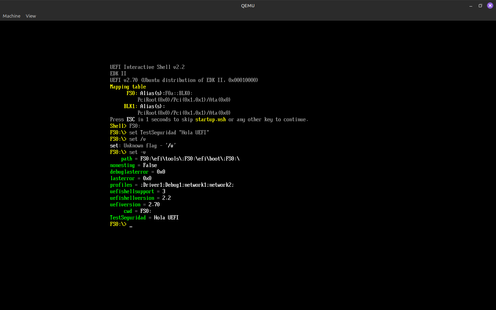

**Pregunta 2: Observando las variables Boot#### y BootOrder, ¿cómo determina el Boot Manager la secuencia de arranque?**

El Boot Manager de UEFI determina la secuencia de arranque utilizando la variable **BootOrder**, que contiene una lista ordenada de identificadores de entrada de arranque (Boot####).

Cada variable **Boot####** representa una opción de arranque específica, incluyendo información como el dispositivo, la ruta al ejecutable EFI y parámetros adicionales.

El proceso funciona de la siguiente manera:

1. El firmware lee la variable **BootOrder** desde la NVRAM.
2. Recorre los identificadores en el orden especificado.
3. Para cada entrada, intenta cargar y ejecutar el binario EFI asociado.
4. Si una opción falla, pasa a la siguiente.

Este mecanismo permite una configuración flexible y persistente del orden de arranque, sin depender de dispositivos físicos fijos como ocurría en el BIOS tradicional.


### 1.4 Footprinting de Memoria y Hardware

Se ejecutó el comando `memmap` para visualizar la distribución de memoria del sistema. 
Este comando permite identificar las distintas regiones utilizadas por el firmware UEFI, incluyendo áreas reservadas para Boot Services, Runtime Services y memoria disponible, proporcionando una visión detallada del uso de memoria en el entorno pre-OS.

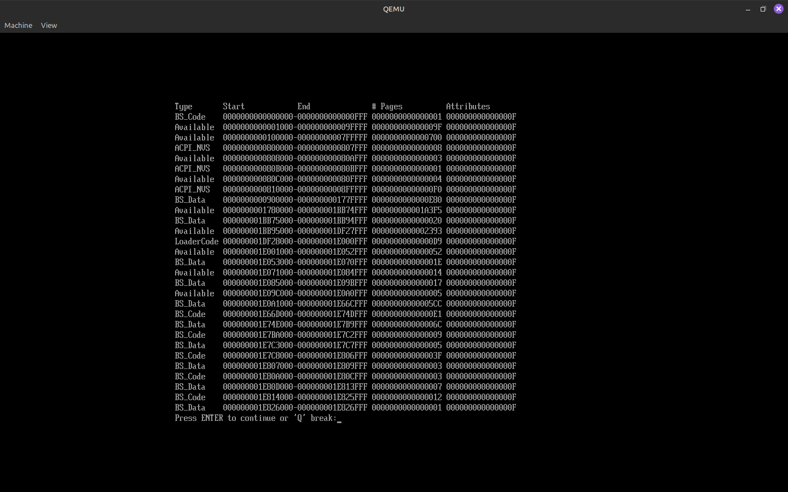

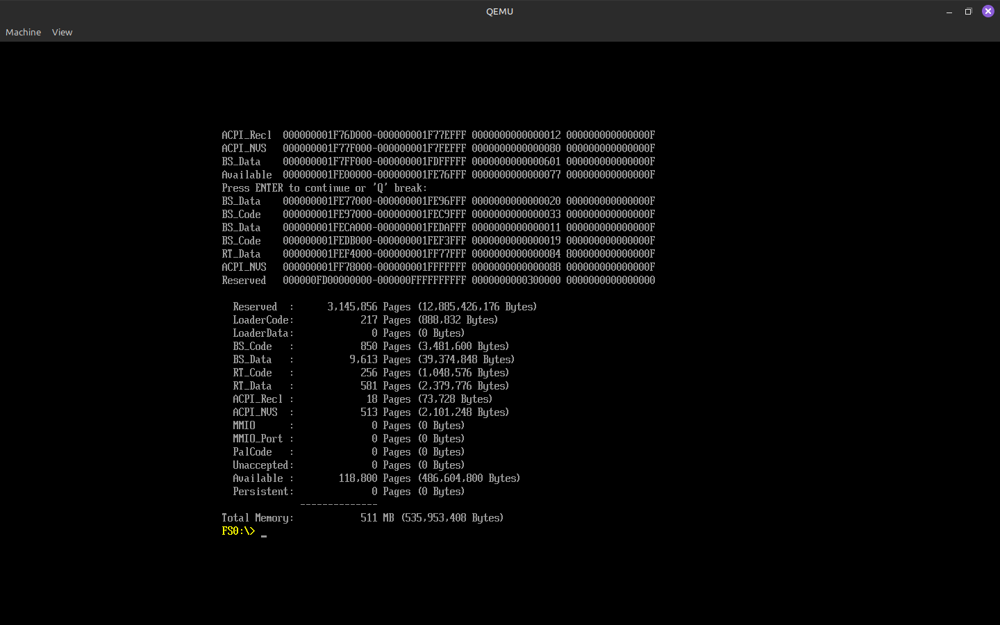

Se utilizó el comando `pci` para listar los dispositivos conectados al bus PCI del sistema. 
Este comando permite inspeccionar el hardware detectado por el firmware, mostrando información relevante sobre dispositivos como controladores de red, almacenamiento y otros periféricos.

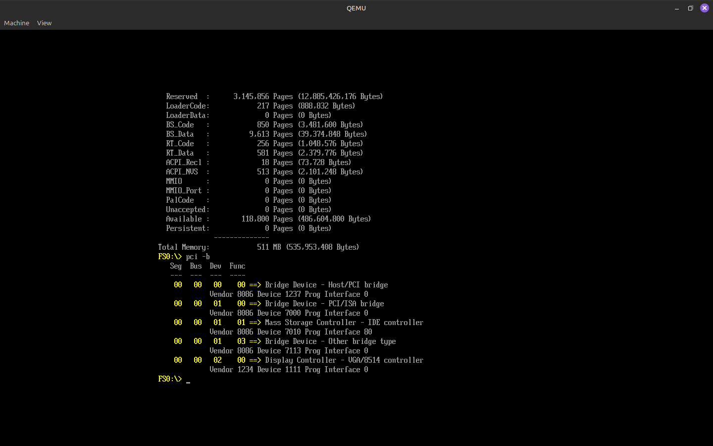

Se ejecutó el comando `drivers` para visualizar los controladores cargados en el entorno UEFI. 
Este listado muestra los drivers responsables de gestionar los distintos dispositivos del sistema, evidenciando el modelo modular de UEFI basado en la carga dinámica de controladores.

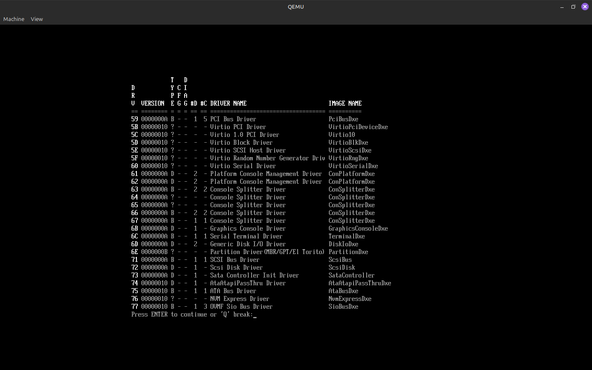

**Pregunta 3: En el mapa de memoria (`memmap`), existen regiones marcadas como RuntimeServicesCode. ¿Por qué estas áreas son un objetivo principal para los desarrolladores de malware (Bootkits)?**

Las regiones marcadas como **RuntimeServicesCode** contienen código del firmware UEFI que permanece accesible incluso después de que el sistema operativo ha tomado el control, ya que forman parte de los *Runtime Services*.

Estas áreas son un objetivo atractivo para los bootkits por varias razones:

- **Persistencia:** El código en estas regiones sigue disponible durante la ejecución del sistema operativo, permitiendo mantener funcionalidad maliciosa activa incluso después del arranque.
- **Alto privilegio:** Se ejecuta en un nivel privilegiado, por debajo del sistema operativo, lo que dificulta su detección y eliminación.
- **Acceso continuo:** Permite interactuar con servicios críticos como variables NVRAM o temporizadores del sistema.

Si un atacante logra modificar estas regiones, puede inyectar código que sobreviva reinicios y opere de forma invisible para el sistema operativo, comprometiendo completamente la seguridad de la plataforma.

## 2. Desarrollo, compilación y análisis de seguridad

### 2.1 Desarrollo de la aplicación

**Pregunta 4: ¿Por qué utilizamos `SystemTable->ConOut->OutputString` en lugar de la función `printf` de C?**

En el entorno UEFI no existe un sistema operativo ni una biblioteca estándar de C completamente funcional, por lo que funciones como `printf` no están disponibles de forma nativa.

En su lugar, UEFI provee sus propios mecanismos de entrada/salida a través de la **System Table**, que contiene punteros a servicios del firmware. En este caso, `ConOut->OutputString` es parte del protocolo de salida de consola.

Además, UEFI utiliza cadenas en formato **Unicode (UTF-16)**, mientras que `printf` trabaja con cadenas ASCII/UTF-8, lo que también hace incompatible su uso directo.

Por lo tanto, para interactuar con la consola en un entorno pre-OS, es necesario utilizar las funciones proporcionadas por el propio firmware.

### 2.3 Análisis de Metadatos y Decompilación

Se utilizaron las herramientas `file` y `readelf` para analizar el formato del binario generado (`.efi`). 

El comando `file` permitió verificar que el ejecutable corresponde al formato PE/COFF, utilizado por UEFI, mientras que `readelf` brindó información detallada sobre la estructura del archivo, como cabeceras y arquitectura.

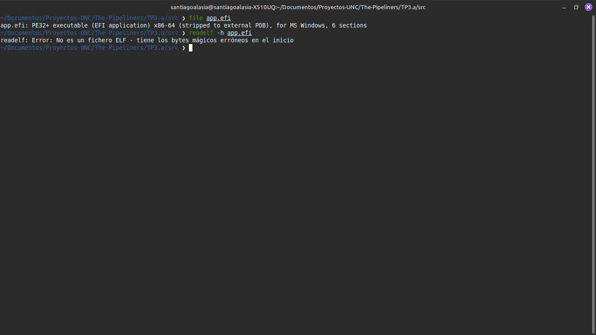

Se utilizó la herramienta Ghidra para analizar el binario `aplicacion.efi` a nivel de código. 

A través del proceso de descompilación, se identificó la función `efi_main`, observándose la lógica implementada en el programa, incluyendo la verificación del valor `0xCC` y la impresión de mensajes mediante los servicios de UEFI.

Este análisis permite comprender cómo el código fuente es representado a bajo nivel dentro del ejecutable.

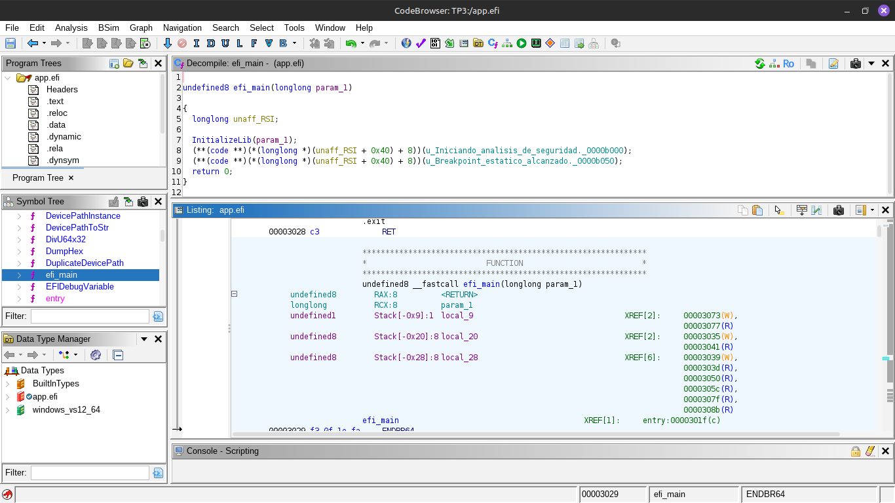

**Pregunta 5: En el pseudocódigo de Ghidra, la condición `0xCC` suele aparecer como `-52`. ¿A qué se debe este fenómeno y por qué importa en ciberseguridad?**

El valor `0xCC` en hexadecimal equivale a **204 en decimal sin signo**. Sin embargo, cuando se interpreta como un `char` con signo (signed char), su valor se convierte en **-52**, debido a la representación en complemento a dos:

204 - 256 = -52

Este fenómeno ocurre porque herramientas como Ghidra pueden interpretar los datos según distintos tipos de datos, y en este caso asume un tipo con signo.

En ciberseguridad, esta diferencia es relevante porque:

- Puede llevar a interpretaciones erróneas del comportamiento del código durante el análisis.
- Los atacantes pueden aprovechar estas ambigüedades para ofuscar código malicioso.
- Es fundamental entender cómo se representan los datos a bajo nivel para analizar correctamente binarios y detectar patrones sospechosos.

En este caso particular, `0xCC` corresponde a la instrucción **INT3** (breakpoint en x86), comúnmente utilizada en debugging y también en técnicas de análisis o evasión.

## 3. Ejecución en Hardware Físico (Bare Metal)

### 3.1 Preparación del medio de arranque (USB)

Para la ejecución en hardware físico, se preparó un dispositivo USB como medio de arranque compatible con UEFI.

En primer lugar, se formateó el pendrive en formato FAT32, requisito establecido por la especificación UEFI para el reconocimiento de dispositivos de arranque.

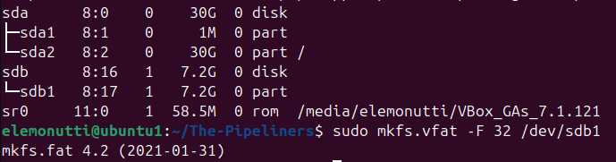

A continuación, se montó el dispositivo y se creó la estructura de directorios estándar utilizada por UEFI:

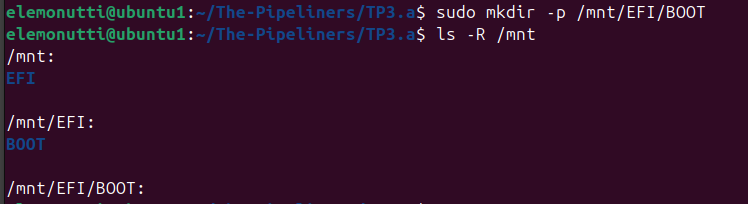

Dentro de esta ruta, se copió la UEFI Shell oficial, ubicada en la ruta `/EFI/BOOT/BOOTX64.EFI`, lo que permite que el firmware la detecte automáticamente durante el proceso de arranque.

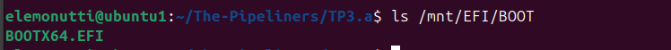

Posteriormente, se copió la aplicación desarrollada (app.efi) en la raíz del dispositivo.

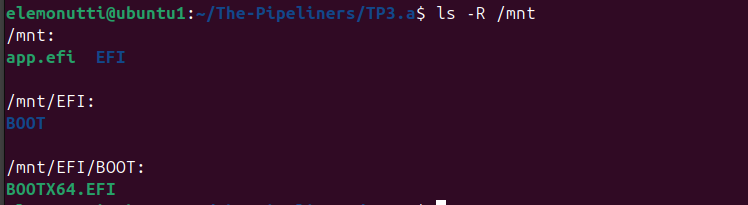

Finalmente, se sincronizaron los cambios y se desmontó el dispositivo de forma segura.

### 3.2 Configuración del BIOS/UEFI

Para permitir la ejecución de aplicaciones UEFI no firmadas, se accedió al firmware del sistema durante el arranque presionando la tecla correspondiente (en este caso, DEL en una laptop MSI).

Dentro del menú de configuración, se realizaron los siguientes ajustes:

- Se deshabilitó la opción Secure Boot, ya que el binario desarrollado no cuenta con firma digital válida.
- Se configuró el modo de arranque en UEFI, asegurando la compatibilidad con aplicaciones en formato PE/COFF.

Estos cambios permiten que el firmware acepte la ejecución de código personalizado desde un dispositivo externo.

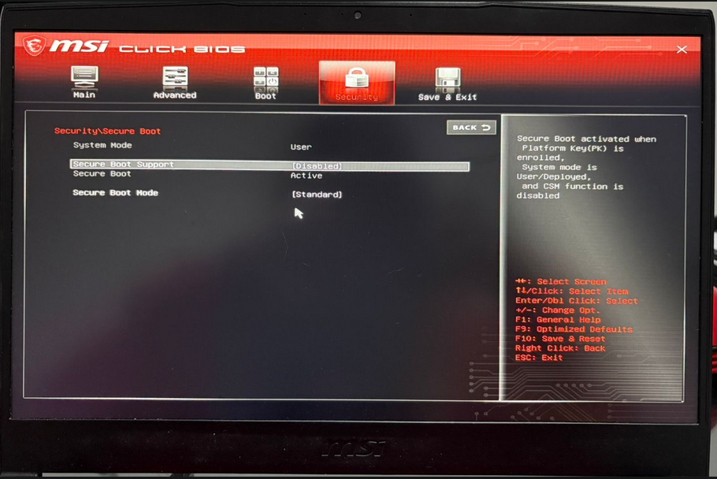

### 3.3 Ejecución en Bare Metal

Una vez configurado el firmware, se procedió a iniciar el sistema desde el dispositivo USB utilizando el menú de arranque (tecla F11 en MSI).

En el menú de selección de dispositivo, se eligió la opción correspondiente al pendrive en modo UEFI:

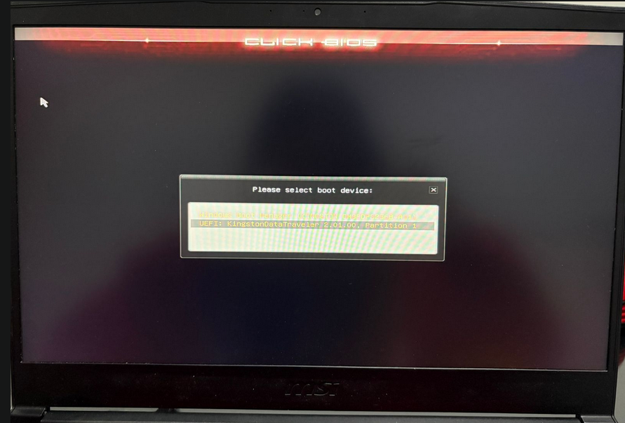

Esto permitió cargar la UEFI Shell, ejecutándose directamente sobre el firmware sin intervención de un sistema operativo.

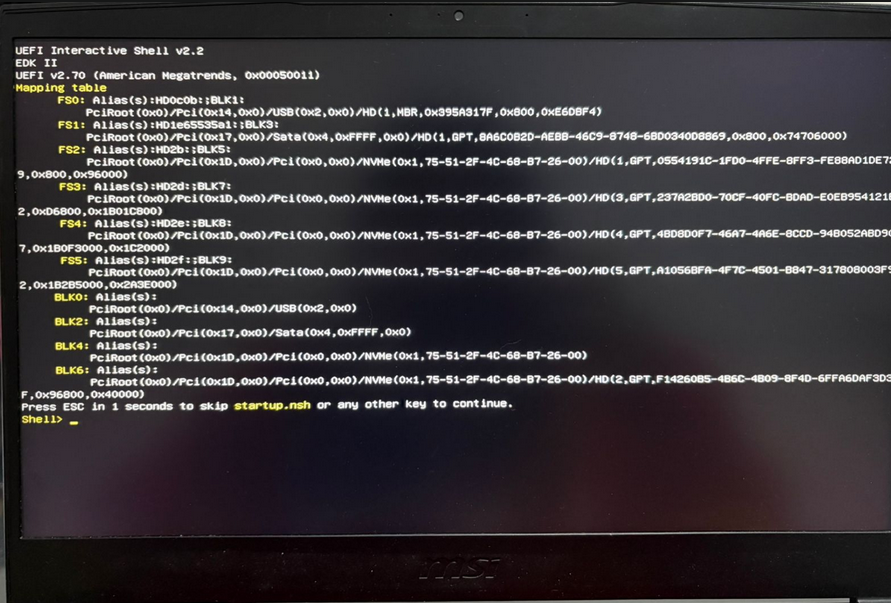

Una vez dentro de la shell, se identificó el dispositivo USB como FS0: mediante la tabla de mapeo de dispositivos.

Se accedió al sistema de archivos y se listaron sus contenidos, verificando la presencia del archivo app.efi y la estructura `/EFI/BOOT`.

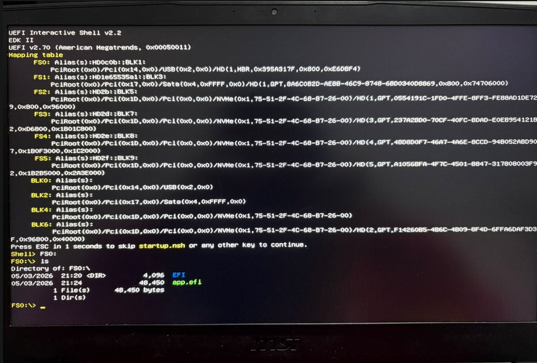

Posteriormente, se ejecutó la aplicación mediante el comando `app.efi`.

**Observación experimental**

A diferencia de la ejecución en entorno virtual (QEMU), en hardware real no se observó salida en pantalla tras la ejecución del programa.

Sin embargo, la shell dejó de responder a la entrada del usuario, siendo necesario reiniciar el sistema manualmente.

Este comportamiento indica que:

- La aplicación fue efectivamente cargada y ejecutada por el firmware.
- El control de la ejecución fue transferido al programa.
- No se retornó correctamente a la shell tras finalizar.

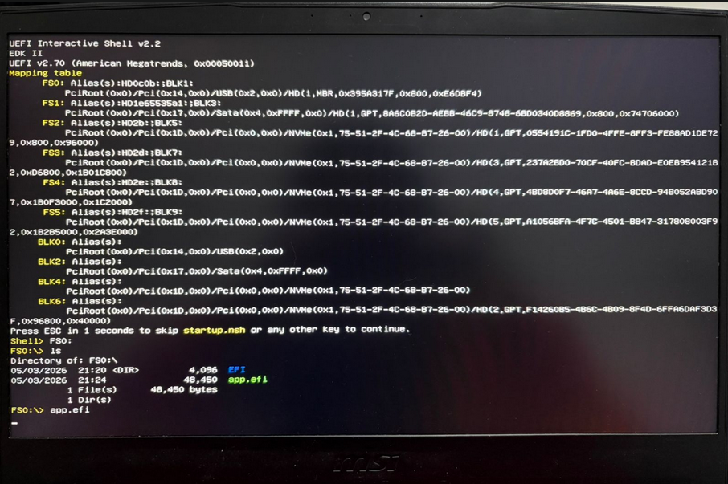

---

## Conclusión general

El presente trabajo permitió comprender el funcionamiento del entorno UEFI como una plataforma independiente del sistema operativo, basada en servicios, protocolos y ejecución de aplicaciones nativas.

Se logró desarrollar, compilar y analizar un binario en formato PE/COFF, así como ejecutarlo tanto en un entorno emulado como en hardware real.

La ejecución en bare metal evidenció diferencias significativas respecto a la emulación, particularmente en la interacción con la consola, lo que resalta la dependencia del firmware específico del fabricante.

Desde el punto de vista de la seguridad, se demostró que es posible ejecutar código arbitrario en etapas tempranas del arranque, lo cual representa un vector potencial para ataques de bajo nivel como los bootkits.