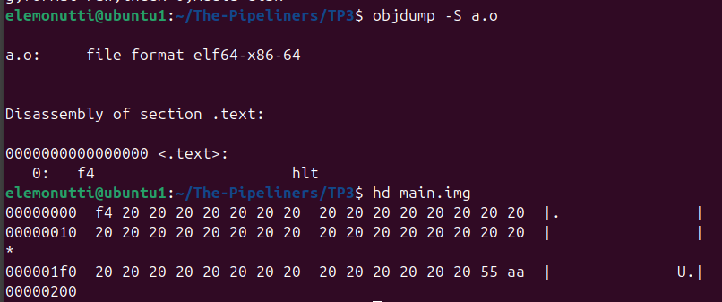
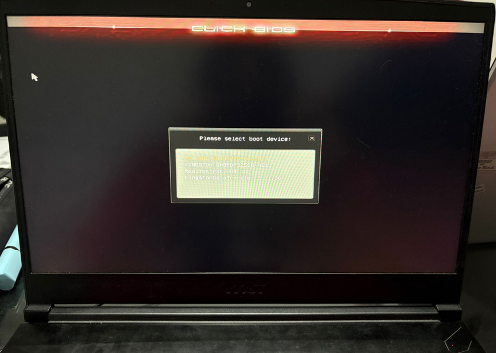
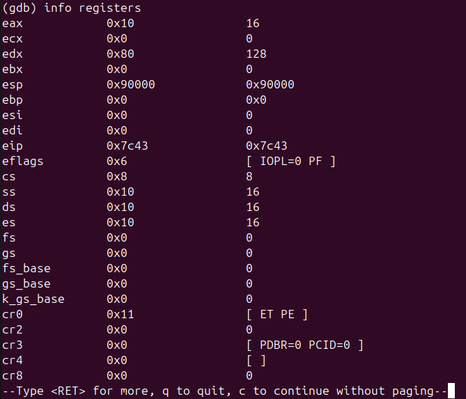
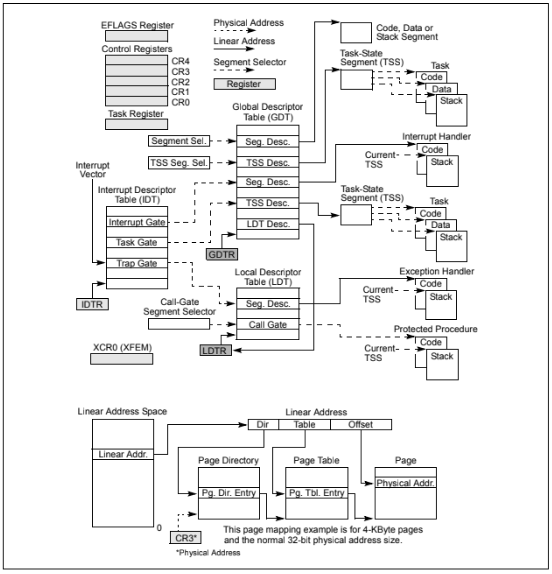

# Trabajo Práctico 3 - Modo Protegido

## Integrantes

- Santiago Alasia
- Lucia Feiguin
- Elena Monutti

## Introducción

En este trabajo práctico se abordan conceptos fundamentales relacionados con el proceso de arranque de una computadora y la ejecución de código a bajo nivel en arquitecturas x86. En particular, se estudian los mecanismos de firmware como UEFI y coreboot, el rol del linker en la construcción de ejecutables y la organización del código en memoria, y el funcionamiento del procesador en modo protegido. 

A lo largo del trabajo se analizan tanto aspectos teóricos como prácticos, incluyendo la generación de imágenes booteables, su ejecución en entornos virtualizados y en hardware real, y el uso de herramientas como QEMU y GDB para observar el comportamiento del sistema.

## Desarrollo 

### 1. UEFI / Coreboot

#### *1.1 ¿Qué es UEFI? ¿como puedo usarlo? Mencionar además una función a la que podría llamar usando esa dinámica*

*UEFI (Unified Extensible Firmware Interface)* es el firmware moderno que reemplaza a la  *BIOS*. Cuando la computadora inicia, la *UEFI* es lo primero que corre y es el encargado de iniciar la computadora, antes del *Sistema Operativo* o cualquier otro programa.

Este surgió como una solución a las limitaciones de la *BIOS*, especialmente en sistemas grandes donde se necesita mayor flexibilidad y soporte para hardware más complejo. Soporta discos de gran tamaño mediante *GPT*, y permite ejecutar programas propios llamados aplicaciones *EFI*.

Su uso se basa en servicios que expone el firmware, a los cuales se puede acceder escribiendo programas (por ejemplo en C), compilados como archivos `.efi` y ejecutándose en entornos como QEMU o en hardware real. Estas aplicaciones pueden utilizar funciones provistas por UEFI, como Print(), que forma parte de los Boot Services y permite mostrar texto en pantalla, por ejemplo: Print(L"Hola desde UEFI\n");.

Además, *UEFI* define dos tipos principales de servicios: los boot services y los runtime services. Los boot services están disponibles únicamente mientras el firmware tiene el control de la máquina, es decir, antes de que se llame a ExitBootServices(), e incluyen funcionalidades como manejo de consola (texto y gráficos), acceso a dispositivos, buses, almacenamiento y sistema de archivos. Por otro lado, los runtime services continúan disponibles incluso después de que el sistema operativo ha arrancado, y permiten realizar tareas como obtener la fecha y hora o acceder a la memoria no volátil (NVRAM).

#### *1.2 ¿Menciona casos de bugs de UEFI que puedan ser explotados?*

Las fallas en implementaciones de UEFI han sido explotadas para lograr persistencia, es decir, la capacidad de mantener acceso malicioso a un sistema comprometido incluso después de reiniciar, reinstalar el sistema operativo e incluso tras el reemplazo parcial de componentes físicos, como el almacenamiento flash persistente en PCI que haya sido comprometido. En 2023 se detectaron vulnerabilidades incluso con Secure Boot habilitado. Ese mismo año, Microsoft publicó una advertencia sobre el *malware UEFI BlackLotus.*

#### *1.3 ¿Qué es Converged Security and Management Engine (CSME), the Intel Management Engine BIOS Extension (Intel MEBx).?*

El *Intel Converged Security and Management Engine (CSME)* es un subsistema integrado en los procesadores Intel que funciona como un microcontrolador independiente dentro del hardware, ejecutando su propio firmware separado del sistema operativo principal. Su objetivo es proporcionar funcionalidades de seguridad y administración a bajo nivel, como soporte criptográfico, arranque seguro y gestión remota del sistema.

El CSME opera incluso cuando la CPU principal está apagada o el sistema operativo no está en ejecución, y tiene acceso directo a recursos como la memoria y dispositivos de red. Por esta razón, aunque aporta capacidades avanzadas de seguridad y administración, también ha sido objeto de preocupaciones debido a posibles vulnerabilidades que podrían comprometer todo el sistema.

La Intel Management Engine BIOS Extension (Intel MEBx) es una interfaz de configuración que aparece dentro del BIOS/UEFI y permite acceder y configurar el Intel Management Engine (ME).

#### *1.4 ¿Qué es coreboot ? ¿Qué productos lo incorporan ?¿Cuales son las ventajas de su utilización?*

*Coreboot* es un proyecto para desarrollar firmware de arranque de código abierto para diversas arquitecturas. Su filosofía de diseño es hacer lo mínimo necesario para asegurar que el hardware sea utilizable y luego transferir el control a otro programa llamado *payload*.

El *payload* puede proporcionar interfaces de usuario, controladores de sistemas de archivos, distintas políticas, etc., para cargar el sistema operativo. Gracias a esta separación de responsabilidades, *coreboot* maximiza la reutilización de las rutinas de inicialización de hardware en muchos casos de uso diferentes, ya sea que utilicen interfaces estándar o flujos de arranque completamente personalizados.

Algunos payloads populares que se utilizan con coreboot son SeaBIOS, que provee servicios de PCBIOS; edk2, que provee servicios UEFI; GRUB2, el cargador de arranque usado por muchas distribuciones Linux; y depthcharge, un cargador de arranque personalizado utilizado en Chromebooks.

Es utilizado en dispositivos como Chromebooks y en algunos equipos de fabricantes como Purism o System76, especialmente en entornos donde la seguridad y la personalización son importantes.

### 2. Linker

#### *2.1 ¿Que es un linker? ¿que hace?*

Un *linker* es una herramienta dentro del proceso de compilación que se encarga de tomar uno o más *objects files* (.o) generados por el compilador y combinarlos para producir un ejecutable. Una de sus funciones es resolver *símbolos*, es decir, resolver las referencias a funciones o variables presentes en librerías (estáticas o dinámicas). Además, el *linker* define en qué posiciones de memoria se ubicaran las distintas secciones del programa. (`.text`, `.data`, `.bss`).

En programas que corren sobre un *OS* las direcciones que define el *linker* son direcciones *virtuales* que luego serán traducidas a direcciones *físicas* de la *Memoria Principal*. Sin embargo, en códigos de bajo nivel como *firmware o BIOS*, el *linker* puede especificar direcciones físicas donde debe ubicarse las secciones de código en memoria.

#### *2.2 ¿Que es la dirección que aparece en el script del linker?¿Porqué es necesaria?*

En la arquitectura x86, la *BIOS* carga el bootloader en la dirección `0x7C00` por convención. (Estándar histórico de la *BIOS*).

En el ejemplo, al iniciar la pc ocurre las siguientes acciones:
   1. La BIOS arranca
   2. Busca el bootloader (USB)
   3. Lee el *MDR* (sector de 512 bytes en donde pusimos nuestro código y lo firmamos)
   4. Lo carga en memoria en la dirección `0x7C00`
   5. Se ejecuta el código

Es por esto que debemos indicarle al *linker* en qué dirección de memoria va a estar ubicado nuestro código.

#### *2.3 Compare la salida de objdump con hd, verifique donde fue colocado el programa dentro de la imagen.*

Para analizar la codificación de las instrucciones, se generó un archivo objeto a partir de una instrucción simple (hlt) utilizando el ensamblador as, y se inspeccionó con objdump. Se observó que la instrucción hlt corresponde al opcode 0xF4.

Posteriormente, se utilizó la herramienta hd para visualizar el contenido binario de la imagen booteable generada (main.img). Se verificó que el primer byte de la imagen es 0xF4, lo cual coincide con la instrucción hlt obtenida previamente.

Esto confirma que el programa se encuentra correctamente ubicado al inicio de la imagen, tal como lo requiere un sector de arranque en arquitecturas x86.

Salidas al ejecutar los comandos:

#### *2.4 Grabar la imagen en un pendrive y probarla en una pc y subir una foto*

La imagen booteable fue generada y posteriormente grabada en un pendrive utilizando el comando dd, previa identificación del dispositivo mediante lsblk y desmontaje de sus particiones.

Luego, se reinició la computadora y se accedió al menú de arranque (boot menu), donde se seleccionó el dispositivo USB correspondiente. Inicialmente, el sistema no detectó el pendrive como booteable debido a que la máquina estaba configurada en modo UEFI, por lo que fue necesario habilitar el modo legacy (CSM) desde la configuración del BIOS.

Una vez configurado correctamente, se logró iniciar el sistema desde el pendrive. Al hacerlo, la computadora ejecutó el código contenido en el sector de arranque, mostrando una pantalla negra. Este comportamiento es esperado, ya que el programa contiene únicamente la instrucción hlt, la cual detiene la CPU sin producir salida visible.

Esto confirma que la imagen fue cargada y ejecutada correctamente en hardware real. Se adjuntaron capturas del menú de arranque y del resultado obtenido.

#### *2.5 ¿Para que se utiliza la opción --oformat binary en el linker?*

`--oformat binary`: Genera codigo ensamblador en formato binario, sin encapsularlo dentro de un archivo ELF como ocurre con los ejecutables normales de usuario.

### 3. Modo Protegido

#### *3.1 Crear un código assembler que pueda pasar a modo protegido (sin macros).*

Se desarrolló un programa en lenguaje assembler que realiza la transición del procesador desde modo real a modo protegido, sin utilizar macros. El código implementa manualmente los pasos necesarios para habilitar este modo de operación. El mismo se encuentra en el archivo `boot.asm`.

En primer lugar, se define una Tabla de Descriptores Globales (GDT) mínima, compuesta por tres entradas: un descriptor nulo, un segmento de código y un segmento de datos. Ambos segmentos abarcan todo el espacio de memoria y poseen los permisos correspondientes para ejecución y acceso a datos.

Luego, se carga la dirección de la GDT mediante la instrucción `lgdt`. A continuación, se habilita el modo protegido modificando el registro de control CR0, activando el bit PE (Protection Enable). Esto se realiza mediante la lectura del registro, la activación del bit menos significativo y su posterior escritura.

Para completar la transición, se ejecuta un salto largo (`ljmp`), que actualiza el registro CS y limpia el pipeline del procesador, permitiendo comenzar la ejecución en modo protegido. Una vez en este modo, se inicializan los registros de segmento de datos (DS, ES, SS) con el selector correspondiente definido en la GDT, y se configura la pila.

La verificación del correcto funcionamiento se realizó utilizando QEMU junto con GDB. Como se observa en la imagen adjunta, el registro CR0 presenta el valor `0x11`, lo que indica que el bit PE se encuentra activado, confirmando que el procesador se encuentra en modo protegido. Además, los registros de segmento contienen valores como `CS = 0x8` y `DS = 0x10`, lo que evidencia que se están utilizando los selectores definidos en la GDT.

Estos resultados confirman que la transición a modo protegido se realizó correctamente.

#### *3.2 ¿Cómo sería un programa que tenga dos descriptores de memoria diferentes, uno para cada segmento (código y datos) en espacios de memoria diferenciados?*

En modo protegido, la gestión de memoria se realiza mediante segmentación a través de la Global Descriptor Table (GDT). Cada segmento de memoria se define mediante un descriptor, el cual especifica su base, límite y atributos de acceso.

Para implementar una separación real entre el segmento de código y el segmento de datos, es posible definir dos descriptores distintos dentro de la GDT, asignando a cada uno un espacio de memoria diferente.

En este esquema, el segmento de código puede ubicarse, por ejemplo, en la región de memoria baja del sistema (base 0x00000000), mientras que el segmento de datos se asigna a una región distinta (por ejemplo, base 0x00100000). De esta forma, ambos segmentos no comparten el mismo espacio de direcciones, evitando el solapamiento lógico de memoria.

Cada descriptor se configura con su base y límite correspondientes, además de sus atributos de acceso. El segmento de código se define con permisos de ejecución, mientras que el segmento de datos se define con permisos de lectura/escritura.

Un ejemplo conceptual de esta configuración sería:

- Segmento de código: base = 0x00000000, límite = 0x000FFFFF
- Segmento de datos: base = 0x00100000, límite = 0x000FFFFF

Esta separación permite que el procesador gestione de forma independiente las regiones de memoria utilizadas para ejecución de instrucciones y almacenamiento de datos. En caso de intentar acceder fuera del rango definido por un segmento, el procesador genera una excepción de protección general (#GP), evitando accesos no autorizados o corrupción de memoria.

En conclusión, la utilización de descriptores con bases y límites diferenciados permite una organización más segura y estructurada del espacio de direcciones en modo protegido.

#### *3.3 Cambiar los bits de acceso del segmento de datos para que sea de solo lectura,  intentar escribir, ¿Que sucede? ¿Que debería suceder a continuación? (revisar el teórico) Verificarlo con gdb.*

Al intentar escribir en el segmento de datos que fue configurado como solo lectura en el descriptor de segmento, se genera una excepción de protección general (#GP), ya que dicha operación viola los permisos definidos en el descriptor (específicamente, el bit de escritura del campo Type no está habilitado).

Las excepciónes de protección general es el mecanismo utilizado por la arquitectura x86 para indicar accesos inválidos a memoria o violaciones de protección. Ante la generación de esta excepción, el procesador intenta consultar la IDT (Interrupt Descriptor Table) para obtener la dirección del handler correspondiente a dicha interrupción. Sin embargo, en este caso no se ha inicializado una IDT válida, por lo que el CPU no puede transferir el control a ningún manejador de excepciones.

#### *3.4 En modo protegido, ¿Con qué valor se cargan los registros de segmento?¿Porque?*

Cuando se opera en modo protegido, los accesos a memoria se realizan a través de los *registros de segmento*, los cuales contienen selectores que referencian entradas en la *GDT* (Global Descriptor Table) o en la *LDT*(Local Descriptor Table), como se puede observar en la imagen (diagrama extraído del manual de Intel).

Estas tablas contienen *descriptores de segmento*, que proporcionan la dirección base de los segmentos, así como los derechos de acceso, el tipo y la información de uso (los cuales se utilizan para calcular y validar los accesos a memoria). 

---

## Conclusión general

A lo largo de este trabajo se logró comprender en profundidad el proceso de arranque de una computadora y el rol que cumplen distintos componentes de bajo nivel. Se analizó cómo el firmware inicializa el sistema y permiten la ejecución de programas antes del sistema operativo. 

Además, se estudió el funcionamiento del linker, destacando su importancia en la organización del código en memoria y su rol clave en el desarrollo de software de bajo nivel, como bootloaders. En la parte práctica, se logró generar una imagen booteable, ejecutarla tanto en un entorno virtual como en hardware real, y verificar su correcto funcionamiento. 

Finalmente, se implementó la transición a modo protegido, comprendiendo el uso de la GDT y la configuración de segmentos de memoria. En conjunto, estos resultados permiten tener una visión integral del funcionamiento interno del sistema en sus etapas iniciales.

---

## Links de Referencia

- https://en.wikipedia.org/wiki/UEFI
- https://tuxcare.com/es/blog/logofail-vulnerabilities/
- https://www.intel.la/content/www/xl/es/download/19392/intel-converged-security-and-management-engine-version-detection-tool-intel-csmevdt.html#:~:text=El%20Intel%C2%AE%20Converged%20Security,de%20seguridad%20recientes%20de%20Intel.
- https://www.reddit.com/r/hardware/comments/1hfp2gs/what_does_intels_management_engine_do/?tl=es-419
- https://www.coreboot.org/
- https://stackoverflow.com/questions/59881880/what-memory-is-impacted-using-the-location-counter-in-linker-script
- https://stackoverflow.com/questions/3322911/what-do-linkers-do/33690144#33690144
- https://stackoverflow.com/questions/22054578/how-can-i-run-a-program-without-an-operating-system/32483545#32483545
