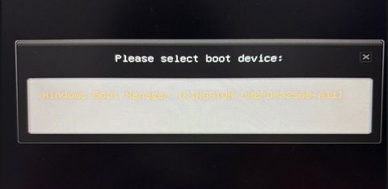
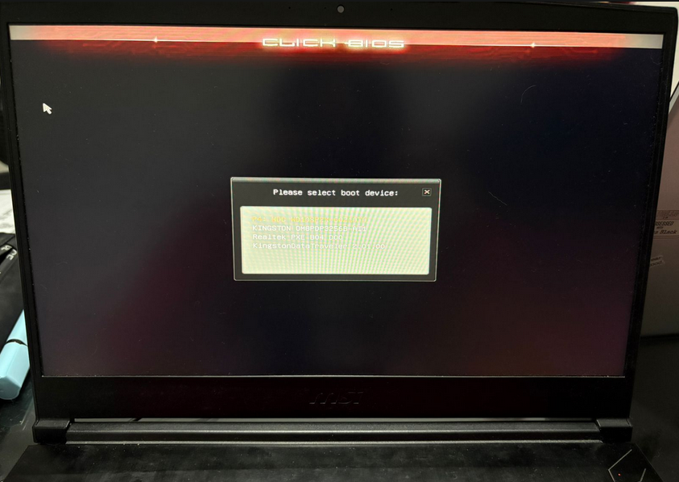
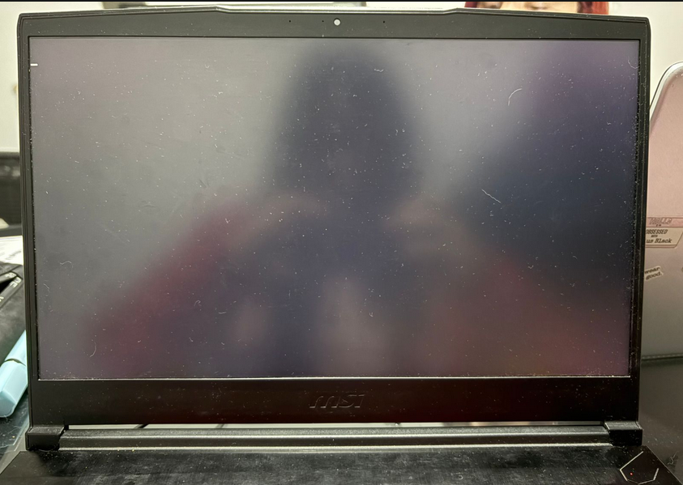

# Trabajo Práctico 3 - Modo Protegido

## Integrantes

- Santiago Alasia
- Lucia Feiguin
- Elena Monutti

## Introducción

## Objetivos 

### 1. UEFI / Coreboot

*1.1 ¿Qué es UEFI? ¿como puedo usarlo? Mencionar además una función a la que podría llamar usando esa dinámica*

**UEFI (Unified Extensible Firmware Interface)** es el firmware moderno que remplaza a la  **BIOS**. Cuando la computadora inicia, la **UEFI** es lo primero que corre y es el encargado de iniciar la computadora, antes del **Sistema Operativo** o que cualquier otro programa.

Este surgio como una solucion a las limitaciones de la **BIOS**, especialmente es sistemas grandes donde se nesesita mayor flecibilidad y soporte para hardware mas complejo. Soporta discos de gran tamaño mediante **GPT**, y permite ejecutar programas propios llamandos aplicaciones **EFI**.

Su uso se basa en servicios que expone el firmware, a los cuales se puede acceder escribiendo programas (por ejemplo en C), compilándolos como archivos `.efi` y ejecutándolos en entornos como QEMU o en hardware real. Estas aplicaciones pueden utilizar funciones provistas por UEFI, como Print(), que forma parte de los Boot Services y permite mostrar texto en pantalla, por ejemplo: Print(L"Hola desde UEFI\n");.

Además, **UEFI** define dos tipos principales de servicios: los boot services y los runtime services. Los boot services están disponibles únicamente mientras el firmware tiene el control de la máquina, es decir, antes de que se llame a ExitBootServices(), e incluyen funcionalidades como manejo de consola (texto y gráficos), acceso a dispositivos, buses, almacenamiento y sistema de archivos. Por otro lado, los runtime services continúan disponibles incluso después de que el sistema operativo ha arrancado, y permiten realizar tareas como obtener la fecha y hora o acceder a la memoria no volátil (NVRAM).

*1.2 ¿Menciona casos de bugs de UEFI que puedan ser explotados?*

Las fallas en implementaciones de UEFI han sido explotadas para lograr persistencia, es decir, la capacidad de mantener acceso malicioso a un sistema comprometido incluso después de reiniciarlo, reinstalar el sistema operativo e incluso tras el reemplazo parcial de componentes físicos, como el almacenamiento flash persistente en PCI que haya sido comprometido. En 2023 se detectaron vulnerabilidades incluso con Secure Boot habilitado. Ese mismo año, Microsoft publicó una advertencia sobre el **malware UEFI BlackLotus.**

*1.3 ¿Qué es Converged Security and Management Engine (CSME), the Intel Management Engine BIOS Extension (Intel MEBx).?*

El *Intel Converged Security and Management Engine (CSME)* es un subsistema integrado en los procesadores Intel que funciona como un microcontrolador independiente dentro del hardware, ejecutando su propio firmware separado del sistema operativo principal. Su objetivo es proporcionar funcionalidades de seguridad y administración a bajo nivel, como soporte criptográfico, arranque seguro y gestión remota del sistema.

El CSME opera incluso cuando la CPU principal está apagada o el sistema operativo no está en ejecución, y tiene acceso directo a recursos como la memoria y dispositivos de red. Por esta razón, aunque aporta capacidades avanzadas de seguridad y administración, también ha sido objeto de preocupaciones debido a posibles vulnerabilidades que podrían comprometer todo el sistema.

*1.4 ¿Qué es coreboot ? ¿Qué productos lo incorporan ?¿Cuales son las ventajas de su utilización?*

*Coreboot* es un proyecto para desarrollar firmware de arranque de código abierto para diversas arquitecturas. Su filosofía de diseño es hacer lo mínimo necesario para asegurar que el hardware sea utilizable y luego transferir el control a otro programa llamado *payload*.

El *payload* puede proporcionar interfaces de usuario, controladores de sistemas de archivos, distintas políticas, etc., para cargar el sistema operativo. Gracias a esta separación de responsabilidades, coreboot maximiza la reutilización de las complejas y fundamentales rutinas de inicialización de hardware en muchos casos de uso diferentes, ya sea que utilicen interfaces estándar o flujos de arranque completamente personalizados.

Algunos payloads populares que se utilizan con coreboot son SeaBIOS, que provee servicios de PCBIOS; edk2, que provee servicios UEFI; GRUB2, el cargador de arranque usado por muchas distribuciones Linux; y depthcharge, un cargador de arranque personalizado utilizado en Chromebooks.

Es utilizado en dispositivos como Chromebooks y en algunos equipos de fabricantes como Purism o System76, especialmente en entornos donde la seguridad y la personalización son importantes.

### 2. Linker

*2.1 ¿Que es un linker? ¿que hace?*

Un *linker* es una herramienta dentro del proceso de compilacion que se encarga de tomar uno o mas *objects files* (.o) generados por el compilador y combinarlos para producir un ejecutable. Una de sus funciones es resolver *simbolos*, es decir, resolver las referencias a funciones o varibales presentes en librerias (estaticas o dinamicas). Ademas, el *linker* define en que posiciones de memoria se ubicaran las distintas secciones del programa. (`.text`, `.data`, `.bss`).

En programas que corren sobre un *OS* las direcciones que define el *linker* son direcciones *virtuales* que luego seran traducidas a direcciones *fisicas* de la *Memoria Principal*. Sin embargo, en codigos de bajo nivel como *firmware o BIOS*, el *linker* puede especifiar direcciones fisicas donde debe ubicarse las secciones de codigo en memoria. 

*2.2 ¿Que es la dirección que aparece en el script del linker?¿Porqué es necesaria?*

En la arquitectura x86, la *BIOS* carga el boatloader en la direccion `0x7C00` por convencion. (Estandar historico de la *BIOS*).

Al usar la imagen creada en el ejemplo, al iniciar la pc ocurre las siguientes acciones:
    1. La BIOS arranca
    2. Busca el bootloader (USB)
    3. Lee el *MDR* (sector de 512 bytes en donde pusimos nuestro codigo)
    4. Lo carga en memoria en la direccion `0x7C00`
    5. Se ejecuta el codigo

Es por esto que debemos indicarle al *linker* en que direccion de memoria va a estar ubicado nuestro codigo.

*2.3 Compare la salida de objdump con hd, verifique donde fue colocado el programa dentro de la imagen.*

Para analizar la codificación de las instrucciones, se generó un archivo objeto a partir de una instrucción simple (hlt) utilizando el ensamblador as, y se inspeccionó con objdump. Se observó que la instrucción hlt corresponde al opcode 0xF4.

Posteriormente, se utilizó la herramienta hd para visualizar el contenido binario de la imagen booteable generada (main.img). Se verificó que el primer byte de la imagen es 0xF4, lo cual coincide con la instrucción hlt obtenida previamente.

Esto confirma que el programa se encuentra correctamente ubicado al inicio de la imagen, tal como lo requiere un sector de arranque en arquitecturas x86.

Salidas al ejecutar los comandos:

*2.4 Grabar la imagen en un pendrive y probarla en una pc y subir una foto*

La imagen booteable fue generada y posteriormente grabada en un pendrive utilizando el comando dd, previa identificación del dispositivo mediante lsblk y desmontaje de sus particiones.

Luego, se reinició la computadora y se accedió al menú de arranque (boot menu), donde se seleccionó el dispositivo USB correspondiente. Inicialmente, el sistema no detectó el pendrive como booteable debido a que la máquina estaba configurada en modo UEFI, por lo que fue necesario habilitar el modo legacy (CSM) desde la configuración del BIOS.

Una vez configurado correctamente, se logró iniciar el sistema desde el pendrive. Al hacerlo, la computadora ejecutó el código contenido en el sector de arranque, mostrando una pantalla negra. Este comportamiento es esperado, ya que el programa contiene únicamente la instrucción hlt, la cual detiene la CPU sin producir salida visible.

Esto confirma que la imagen fue cargada y ejecutada correctamente en hardware real. Se adjuntaron capturas del menú de arranque y del resultado obtenido.

*2.5 ¿Para que se utiliza la opción --oformat binary en el linker?*

`--oformat binary`: Genera codigo ensamblador en formato binario, sin encapsularlo dentro de un archivo ELF como ocurre con los ejecutables normales de usuario.

### 3. Modo Protegido

---

## Conclusión general

---

## Links de Referencia

- https://en.wikipedia.org/wiki/UEFI
- https://tuxcare.com/es/blog/logofail-vulnerabilities/
- https://www.intel.la/content/www/xl/es/download/19392/intel-converged-security-and-management-engine-version-detection-tool-intel-csmevdt.html#:~:text=El%20Intel%C2%AE%20Converged%20Security,de%20seguridad%20recientes%20de%20Intel.
- https://www.reddit.com/r/hardware/comments/1hfp2gs/what_does_intels_management_engine_do/?tl=es-419
- https://www.coreboot.org/
- https://stackoverflow.com/questions/59881880/what-memory-is-impacted-using-the-location-counter-in-linker-script
- https://stackoverflow.com/questions/3322911/what-do-linkers-do/33690144#33690144
- https://stackoverflow.com/questions/22054578/how-can-i-run-a-program-without-an-operating-system/32483545#32483545