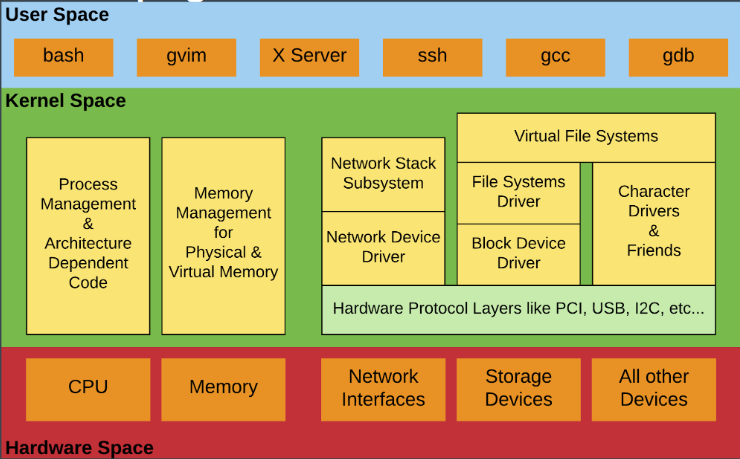
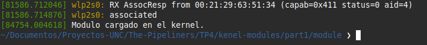
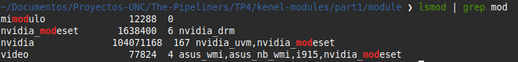
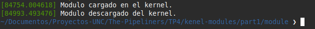
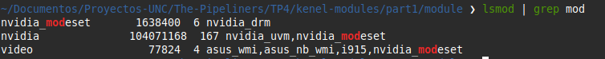
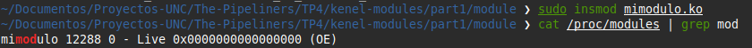
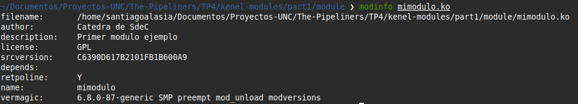
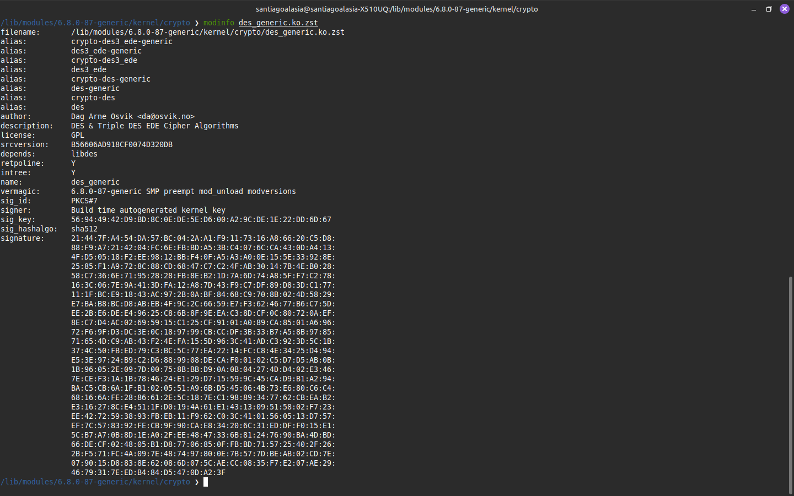
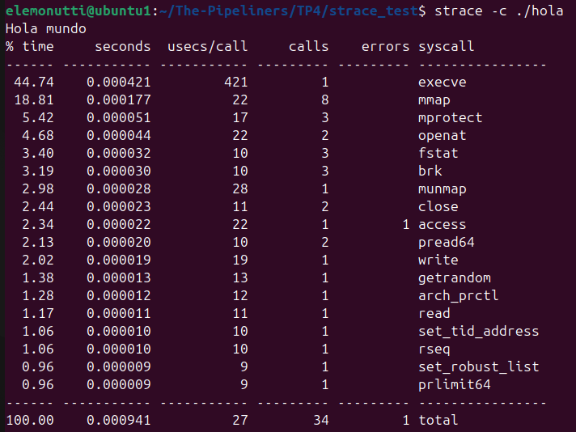

# Trabajo Práctico 4 - Módulos de Kernel y llamadas a Sistema
## Integrantes

- Santiago Alasia
- Lucia Feiguin
- Elena Monutti

## Link del Repositorio

```
https://github.com/SantiagoAlasia/The-Pipeliners/tree/main/TP4
```

## Introducción

## Objetivos 

## Desafio 1

### ¿Qué es checkinstall y para qué sirve?
### ¿Se animan a usarlo para empaquetar un hello world? 
### Revisar la bibliografía para impulsar acciones que permitan mejorar la seguridad del kernel, concretamente: evitando cargar módulos que no estén firmados. rootkits ? 

## Desafio 2

### Debe tener respuestas precisas a las siguientes preguntas y sentencias:
1. ¿Qué funciones tiene disponible un programa y un módulo?

Un programa de usuario utiliza funciones provistas por bibliotecas del sistema (como libc) y accede a los recursos del sistema operativo mediante **system calls (syscalls)**. Algunas de las más comunes son:

```
open(),
read(),
write(),
etc.
```

Estas llamadas permiten interactuar con archivos, dispositivos y otros recursos del sistema de **manera controlada** y **segura**, ya que el sistema operativo restringe el acceso directo al hardware y a la memoria del kernel.

En cambio, un módulo del kernel se ejecuta en espacio de kernel, por lo que no utiliza bibliotecas de usuario como libc. Las funciones y símbolos que puede utilizar son proporcionados por el kernel.

Estas funciones pueden observarce en el archivo ´/proc/kallsyms´, el cual contiene la tabla de símbolos del kernel cargados actualmente en memoria, incluyendo funciones y variables globales disponibles para otros módulos.

Por ejemplo:

```
printk()
```

2. Espacio de usuario o espacio del kernel.

Cada proceso de usuario posee su propio espacio de memoria aislado, lo que evita que un programa pueda acceder directamente a la memoria de otro proceso o del kernel. Esta separación aporta estabilidad y seguridad al sistema. Cuando un programa de usuario falla, normalmente solo finaliza dicho proceso sin afectar al resto del sistema operativo.

Por otro lado, el kernel y los módulos cargados se ejecutan dentro del espacio del kernel, compartiendo el mismo **espacio de memoria privilegiado**. Debido a esto, un error dentro de un módulo del kernel puede comprometer la estabilidad de todo el sistema, provocando fallas graves.

En la *Figura 1* puede observarse una distribución lógica entre el espacio de usuario y el espacio del kernel.

<div align="center">
  <br>
  <em>Figura 1: Espacio de Usuario vs Espacio del Kernel</em>
</div>

3. Espacio de datos.

El espacio de datos es la región de memoria de un programa donde se almacenan las **variables** y **datos utilizados** durante su ejecución. Este es fundamental porque contiene el estado y la información que utiliza el programa mientras se ejecuta.

Dentro de la memoria de un proceso existen distintas secciones, cada una con un propósito específico. Las secciones `.data` y `.bss` forman parte del espacio de datos del programa. Además, durante la ejecución el programa puede reservar memoria dinámica en el **heap** utilizando funciones como `malloc()`.

En el caso de los módulos del kernel sucede algo similar, aunque la memoria es administrada directamente por el kernel mediante funciones como `kmalloc()`.

4. Drivers. Investigar contenido de /dev.

Los **Drivers** o controladores de dispositivos son un módulos especiales que proporcionan funcionalidad para un hardware especifico, como discos, teclados, placas de red, GPU o dispositivos USB. Como en los sistemas **Unix** los dispositivos se mapean como archivos, los vamos a encontrar asociados con alguna entrada en `/dev`. Esto permite interactuar con el hardware utilizando operaciones similares a las realizadas sobre archivos comunes, como `read()` o `write()`.

Para inspeccionar el contenido de `/dev` pueden utilizarse los siguientes comandos:

```
cd /dev
```

```
ls -l
```

La salida mostrará distintos archivos asociados a dispositivos del sistema. Por ejemplo:

```
brw-rw----  1 root disk      8,     0 jul 11  2025 sda

crw-rw-rw-  1 root tty       5,     0 may 20 12:15 tty
```

> **Obs:** En esta salida puede observarse que al comienzo aparece una letra que indica el tipo de dispositivo:
>- **c**	dispositivo de caracteres (character device)
>- **b**	dispositivo de bloques (block device)
>
>Los dispositivos de caracteres transfieren información byte a byte, como terminales o teclados. En cambio, los dispositivos de bloques
>trabajan con bloques de datos, como discos rígidos o pendrives.
>
>Además, aparecen dos números llamados **mayor** y **menor**:
>- El número **mayor** identifica al driver o controlador asociado al dispositivo.
>- El número **menor** identifica una instancia específica controlada por ese driver.
>
> Por ejemplo, distintos discos pueden compartir el mismo número major (mismo driver) pero tener distintos minor para diferenciar cada 
>dispositivo físico o partición.

## Desafio 3

### Pasos para la compilación y carga de un módulo de kernel.

```
cd kernel-modules/part1/module
```

```
make clean
make all
```

```
sudo insmod mimodulo.ko
```

```
sudo dmesg
```

<div align="center">
  <br>
  <em>Figura 2: Log de eventos luego de cargar el módulo de kernel.</em>
</div>

```
lsmod | grep mod
```

<div align="center">
  <br>
  <em>Figura 3: Lista de módulos cargados filtrados por "mod".</em>
</div>

```
sudo rmmod mimodulo
```

```
sudo dmesg
```

<div align="center">
  <br>
  <em>Figura 4: Log de eventos luego de quitar el módulo de kernel.</em>
</div>

```
lsmod | grep mod
```

<div align="center">
  <br>
  <em>Figura 5: Lista de módulos cargados filtrados por "mod".</em>
</div>

```
/proc/modules es un archivo del virtual filesystem que muestra los módulos del kernel que están actualmente cargados en memoria. Para poder ver el contenido podemos ejecutar el siguiente comando.

cat /proc/modules  | grep mod
```

<div align="center">
  <br>
  <em>Figura 6: Lista de módulos cargados filtrados por "mod".</em>
</div>

```
modinfo mimodulo.ko 
```

<div align="center">
  <br>
  <em>Figura 7: Descripción del modulo.</em>
</div>

```
modinfo /lib/modules/$(uname -r)/kernel/crypto/des_generic.ko
```

<div align="center">
  <br>
  <em>Figura 8: Descripción del modulo crypto.</em>
</div>

### Preguntas

1. ¿Qué diferencias se pueden observar entre los dos modinfo? 

Observando las **Figuras 7 y 8** puede verse que el módulo desarrollado manualmente (**mimodulo.ko**) posee una cantidad reducida de metadata, mientras que el módulo oficial del kernel incluye información adicional como:

- alias
- dependencias
- versión
- firma digital

Uno de los campos más importantes es el correspondiente a la **firma digital**, ya que permite verificar la autenticidad e integridad del módulo antes de que sea cargado por el kernel. Esto resulta especialmente importante en sistemas con Secure Boot habilitado, donde únicamente pueden cargarse módulos firmados por claves consideradas confiables por el sistema.

2. ¿Qué divers/modulos estan cargados en sus propias pc? comparar las salidas con las computadoras de cada integrante del grupo. Expliquen las diferencias. **Carguen un txt con la salida de cada integrante en el repo y pongan un diff en el informe.**

Para revisar los modulos que estan cargados y generar un .txt podemos ejecutar los siguientes comandos:

```
cd drivers

lsmod > <apellido_del_interante>.txt
```

## CARGAR EL DIFF DE LOS .TXT

Las diferencias observadas entre los módulos cargados en cada computadora se deben al hardware disponible y a los servicios activos en cada sistema. Por ejemplo, equipos con diferentes placas de red, GPU o dispositivos Bluetooth requieren drivers distintos.

3. ¿Cuales no están cargados pero están disponibles? ¿Que pasa cuando el driver de un dispositivo no está disponible?.

Para determinar qué módulos se encuentran disponibles en el sistema, pero no están actualmente cargados en el kernel, pueden utilizarse distintos comandos.

En primer lugar, podemos listar todos los módulos disponibles:

```
find /lib/modules/$(uname -r) -name "*.ko.zst"
```

Este comando muestra los módulos presentes en el **file system**, es decir, aquellos que el kernel puede cargar si son necesarios.

Luego, puede filtrarse la búsqueda según el módulo que se desea inspeccionar:

```
find /lib/modules/$(uname -r) | grep <nombre_del_modulo>
```

Si el módulo aparece en la salida, significa que está disponible en el sistema.

Finalmente, para verificar si dicho módulo se encuentra actualmente **cargado** en memoria, puede utilizarse:

```
lsmod | grep <nombre_del_modulo>
```

Si el comando no devuelve resultados, entonces el módulo está **disponible pero no cargado**.

Por otro lado, si el driver de un dispositivo no se encuentra disponible, el sistema operativo no podrá comunicarse correctamente con dicho hardware. Como consecuencia, el dispositivo puede no ser detectado, funcionar de manera limitada o directamente quedar inutilizable dentro del sistema operativo.

4. Correr hwinfo en una pc real con hw real y agregar la url de la información de hw en el reporte.

`hwinfo` es una herramienta de Linux que permite obtener información detallada del hardware del sistema.

```
hwinfo > hwinfo.txt
```

La salida la podemos encontrar en el archivo `hwinfo.txt` del repo.

5. ¿Qué diferencia existe entre un módulo y un programa? 

Existen varias diferencias entre un **programa de usuario** y un **módulo del kernel**, una de las más importantes es la forma en la que comienzan su ejecución y cómo interactúan con el sistema operativo.

Un programa inicia su ejecución en la función **main()**, ejecuta sus instrucciones y, al finalizar, retorna el control al sistema operativo o al proceso que lo invocó.

En cambio, un módulo del kernel posee **funciones especiales** de inicialización y finalización (module_init(), module_exit()).

La función de inicialización se ejecuta cuando el módulo es **cargado en el kernel** y se utiliza para registrar la funcionalidad que el módulo provee, inicializar estructuras o reservar recursos necesarios. Posteriormente, el módulo permanece cargado y el kernel puede utilizar sus servicios cuando sean requeridos. La función de salida se ejecuta al **descargar** el módulo y permite liberar recursos y limpiar el estado interno.

Otra diferencia fundamental es el **entorno de ejecución**. Los programas se ejecutan en el **espacio de usuario (user space)**, donde poseen acceso restringido a los recursos del sistema. No pueden acceder directamente al hardware ni a la memoria del kernel. Para realizar operaciones privilegiadas, como acceder a archivos, dispositivos o memoria protegida, deben solicitar **servicios al sistema operativo** mediante system calls (syscalls).

Por el contrario, los módulos se ejecutan dentro del **espacio del kernel (kernel space)**, compartiendo el mismo entorno de ejecución que el kernel Linux. Debido a esto, poseen acceso privilegiado al hardware, memoria física y estructuras internas del sistema operativo.

Como consecuencia, si un programa de usuario falla, normalmente solo termina el proceso asociado. Sin embargo, si un módulo del kernel contiene errores, puede comprometer la estabilidad completa del sistema.

Otra característica importante es que los módulos pueden cargarse y descargarse dinámicamente en tiempo de ejecución permitiendo extender las funcionalidades del kernel sin necesidad de reiniciar el sistema operativo.

6. ¿Cómo puede ver una lista de las llamadas al sistema que realiza un simple helloworld en c?

Para observar las system calls que realiza un programa en Linux puede utilizarse la herramienta strace.

Primero creamos un programa simple:

```
#include <stdio.h>

int main() {
    printf("Hola mundo\n");
    return 0;
}
```

Compilación:

```
gcc -Wall hola.c -o hola
```

Luego ejecutamos strace:
```
strace ./hola
```

Este comando muestra todas las llamadas al sistema realizadas por el programa, incluyendo operaciones de carga de librerías dinámicas, acceso a memoria, escritura en pantalla y finalización del proceso.

También pueden utilizarse variantes útiles:

```
strace -tt ./hola
```

Muestra timestamps precisos para cada syscall.

```
strace -c ./hola
```

Genera un resumen estadístico de las llamadas al sistema realizadas.

<div align="center"> 
  <br> 
  <em>Figura 9: Resumen de system calls obtenidas mediante strace.</em> 
</div>

Entre las syscalls más comunes que aparecerán se encuentran:

- `execve()`
- `mmap()`
- `openat()`
- `read()`
- `write()`
- `close()`

Por ejemplo, la llamada:

```
write(1, "Hola mundo\n", 11)
```

indica que el programa escribe el texto en el descriptor de archivo 1, correspondiente a la salida estándar (`stdout`).

Esto demuestra que incluso un programa muy simple depende de múltiples servicios proporcionados por el kernel Linux.

7. ¿Qué es un segmentation fault? ¿Cómo lo maneja el kernel y como lo hace un programa?

Un segmentation fault (o simplemente segfault) ocurre cuando un programa intenta acceder a una región de memoria que no tiene permitida.

Algunos ejemplos comunes son:

- acceder a un puntero NULL
- escribir fuera de los límites de un arreglo
- acceder a memoria liberada
- intentar ejecutar memoria no ejecutable

Ejemplo:

```
int *ptr = NULL;
*ptr = 10;
```

En este caso el proceso intenta escribir en una dirección inválida y el procesador genera una excepción de memoria.

El kernel Linux detecta esta situación mediante la Memory Management Unit (MMU) del procesador. Cuando ocurre el acceso inválido, el hardware genera una interrupción conocida como page fault y el kernel verifica si el acceso es válido.

Si el acceso no está permitido, el kernel envía al proceso la señal:

`SIGSEGV`

Por defecto, esta señal finaliza el programa y puede generar un core dump para depuración.

En programas de usuario, normalmente el fallo solo afecta al proceso que cometió el error gracias al aislamiento de memoria entre procesos.

Sin embargo, en el caso de un módulo del kernel, el código se ejecuta en espacio privilegiado compartiendo memoria con el kernel. Por esta razón, un acceso inválido dentro de un módulo puede provocar:

- kernel panic
- congelamiento del sistema
- reinicio completo
- corrupción de memoria

Esto demuestra por qué el desarrollo de módulos del kernel requiere mucho más cuidado que la programación tradicional en espacio de usuario.

8. ¿Se animan a intentar firmar un módulo de kernel ? y documentar el proceso ?  https://askubuntu.com/questions/770205/how-to-sign-kernel-modules-with-sign-file


9. Agregar evidencia de la compilación, carga y descarga de su propio módulo imprimiendo el nombre del equipo en los registros del kernel. 


10. ¿Que pasa si mi compañero con secure boot habilitado intenta cargar un módulo firmado por mi? 

Aunque el módulo esté firmado correctamente, el sistema solamente permitirá cargarlo si la clave utilizada para firmarlo pertenece a una entidad confiable para el sistema.

Si el compañero no tiene registrada la clave pública (MOK.der) dentro de su sistema, el kernel rechazará el módulo.

Generalmente aparecerá un mensaje similar a:

`Required key not available`

o

`module verification failed`

Esto sucede porque Secure Boot verifica que los módulos hayan sido firmados por claves autorizadas.

Para que el módulo pueda cargarse correctamente, el compañero debe importar previamente el certificado público mediante:

```
mokutil --import MOK.der
```

11. Dada la siguiente nota https://arstechnica.com/security/2024/08/a-patch-microsoft-spent-2-years-preparing-is-making-a-mess-for-some-linux-users/ 

Según el artículo publicado por Ars Technica, Microsoft distribuyó una actualización relacionada con Secure Boot y la vulnerabilidad conocida como BootHole.

El problema principal fue que algunos sistemas Linux con arranque dual comenzaron a tener problemas para iniciar correctamente luego de aplicar las nuevas políticas de seguridad.

12. ¿Cuál fue la consecuencia principal del parche de Microsoft sobre GRUB en sistemas con arranque dual (Linux y Windows)?

La consecuencia principal fue que muchos sistemas Linux dejaron de arrancar correctamente porque las nuevas políticas de Secure Boot bloquearon versiones antiguas de GRUB consideradas vulnerables.

Como resultado:

- algunos equipos no podían iniciar Linux
- aparecían errores relacionados con Secure Boot
- ciertos sistemas entraban directamente al firmware UEFI

Esto afectó especialmente a usuarios con configuraciones dual boot entre Linux y Windows.

13. ¿Qué implicancia tiene desactivar Secure Boot como solución al problema descrito en el artículo?

Desactivar Secure Boot permite volver a cargar bootloaders o módulos no firmados, solucionando temporalmente el problema de compatibilidad.

Sin embargo, esto reduce significativamente la seguridad del sistema porque elimina la validación criptográfica durante el proceso de arranque.

Como consecuencia:

- podrían cargarse bootloaders modificados
- podrían ejecutarse rootkits de bajo nivel
- el sistema queda más expuesto a malware persistente

Por esta razón, desactivar Secure Boot debe considerarse solamente una solución temporal o de diagnóstico.

14. ¿Cuál es el propósito principal del Secure Boot en el proceso de arranque de un sistema?

El propósito principal de Secure Boot es garantizar que únicamente se ejecute software confiable durante el arranque del sistema.

Para ello, Secure Boot verifica firmas digitales de:

- bootloaders
- kernels
- drivers
- módulos

De esta manera se evita que software malicioso pueda ejecutarse antes de que el sistema operativo inicie completamente.

Esto ayuda a proteger el sistema contra amenazas como:

- bootkits
- rootkits
- malware persistente de bajo nivel

## Conclusión general
