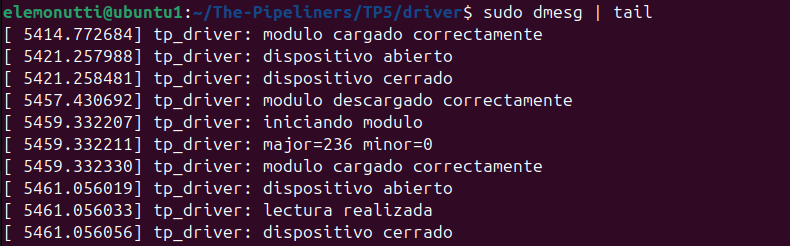

# Trabajo Práctico 5 - Device drivers
## Integrantes

- Santiago Alasia
- Lucia Feiguin
- Elena Monutti

## Link del Repositorio

## Introducción

## Objetivos 

## Desarrollo

**Creación del primer módulo del kernel**

Como primera aproximación al desarrollo de drivers Linux, se implementó un módulo básico del kernel escrito en lenguaje C.

El módulo implementa dos funciones principales:

- Una función de inicialización ejecutada al cargar el módulo mediante insmod.
- Una función de salida ejecutada al remover el módulo mediante rmmod.

Estas funciones se registran utilizando las macros module_init() y module_exit(), las cuales forman parte de la infraestructura estándar para módulos Linux.

Además, se utilizó la función printk() para registrar mensajes en el log del kernel, permitiendo verificar el correcto funcionamiento del módulo mediante el comando dmesg.

**Compilación del módulo**

La compilación del módulo se realizó utilizando el sistema de build provisto por el kernel Linux mediante un archivo `Makefile`.

El archivo Makefile utilizado fue:

obj-m += tp_driver.o

all:
	make -C /lib/modules/$(shell uname -r)/build M=$(PWD) modules

clean:
	make -C /lib/modules/$(shell uname -r)/build M=$(PWD) clean

La directiva `obj-m` indica que el archivo `tp_driver.c` debe compilarse como un módulo del kernel.

La compilación se ejecutó mediante:

make

Como resultado, el sistema generó el archivo `tp_driver.ko`, correspondiente al módulo compilado listo para ser cargado dinámicamente en el kernel Linux.

   
  <em>Figura 1: Compilación exitosa del módulo del kernel y generación del archivo tp_driver.ko.</em>

**Inserción del módulo**

Una vez compilado el módulo, se procedió a cargarlo dinámicamente en el kernel utilizando el comando:

sudo insmod tp_driver.ko

La correcta inserción del módulo se verificó mediante:

lsmod | grep tp_driver

Posteriormente, el módulo fue removido utilizando:

sudo rmmod tp_driver

Este procedimiento permitió validar el correcto funcionamiento de las funciones de inicialización y salida implementadas en el módulo.

   
  <em>Figura 2: Verificación de la correcta carga del módulo `tp_driver` en el kernel Linux.</em>

**Verificación mediante dmesg**

Los mensajes generados por el módulo fueron verificados mediante el comando:

sudo dmesg | tail

A través de este mecanismo fue posible observar los mensajes emitidos por printk() durante la carga y descarga del módulo.

Esto permitió confirmar la correcta ejecución de las funciones del módulo dentro del espacio de kernel.

   
  <em>Figura 3: Mensajes del kernel generados durante la carga y descarga del módulo.</em>

### Implementación del Character Device Driver

Luego de validar el funcionamiento básico de un módulo del kernel, se avanzó en la implementación de un Character Device Driver (CDD).

Para ello, se incorporó el registro dinámico de números major y minor mediante la función:

alloc_chrdev_region()

Esto permitió que el kernel identificara el dispositivo de caracteres implementado.

Posteriormente, se definió una estructura `file_operations`, utilizada para asociar las operaciones del sistema de archivos con las funciones implementadas por el driver. En esta etapa se incorporaron las operaciones:

- `open`
- `read`
- `release`

La estructura utilizada fue:

static struct file_operations fops = {
    .owner = THIS_MODULE,
    .open = my_open,
    .read = my_read,
    .release = my_release,
};

Además, se utilizó la estructura `cdev` para registrar el dispositivo dentro del kernel mediante:

cdev_init()
cdev_add()

Finalmente, se creó automáticamente el archivo de dispositivo dentro del directorio `/dev` utilizando:

class_create()
device_create()

Como resultado, el sistema generó el archivo:

/dev/tp_driver

permitiendo la interacción entre espacio de usuario y espacio de kernel mediante operaciones estándar de lectura.

**Implementación de la operación read()**

Se implementó la operación `read()` del driver con el objetivo de transferir información desde el espacio de kernel hacia el espacio de usuario.

Para realizar esta transferencia se utilizó la función:

copy_to_user()

la cual permite copiar datos de manera segura desde memoria del kernel hacia un buffer perteneciente a una aplicación de usuario.

La función implementada devuelve inicialmente un mensaje de prueba:

Hola desde kernel space

La operación fue validada mediante el comando:

sudo cat /dev/tp_driver

obteniéndose correctamente el mensaje enviado desde el driver.

Además, se implementó el manejo del offset de lectura para evitar lecturas infinitas al utilizar herramientas como `cat`.

   
  <em>Figura 4: Lectura exitosa desde el Character Device Driver mediante /dev/tp_driver.</em>

   
  <em>Figura 5: Mensajes del kernel que muestran la carga del módulo, la creación del Character Device Driver y la ejecución de las operaciones open, read y release.</em>

## Conclusión general
