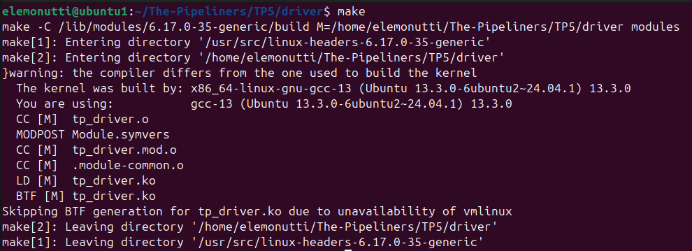
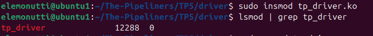
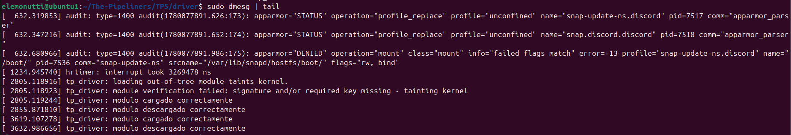

# Trabajo Práctico 5 - Device drivers
## Integrantes

- Santiago Alasia
- Lucia Feiguin
- Elena Monutti

## Link del Repositorio

```
https://github.com/SantiagoAlasia/The-Pipeliners/tree/main/TP5
```

## Introducción

Los Controladores de Dispositivos de Caracteres (Character Device Drivers, CDD) constituyen uno de los mecanismos fundamentales mediante los cuales el sistema operativo Linux permite la comunicación entre el espacio de usuario y los dispositivos de hardware. A través de estos controladores, las aplicaciones pueden acceder a periféricos utilizando una interfaz estándar basada en operaciones de lectura y escritura.

En el presente trabajo práctico se desarrolla un CDD para Linux ejecutándose sobre una **Raspberry Pi Modelo 3B**, capaz de adquirir periódicamente dos señales externas digitales cuyo periodo es de 1 segundo. El controlador realiza el muestreo de las señales con una frecuencia de 20Hz (**cumpliendo con el teorema Nyquist-Shannon) y proporciona una interfaz de acceso mediante un dispositivo de caracteres. Además, permite seleccionar dinámicamente cuál de las dos señales será leída por las aplicaciones de usuario.

Como complemento al controlador, se implementa una aplicación de usuario encargada de obtener los datos desde el dispositivo de caracteres, procesarlos y representarlos gráficamente en función del tiempo. La aplicación también permite seleccionar la señal a visualizar y actualizar el gráfico en consecuencia. Para facilitar la interacción con el sistema y minimizar los requerimientos de hardware, la visualización se realiza mediante una interfaz web accesible desde cualquier navegador.

Todo el desarrollo se lleva a cabo utilizando compilación cruzada (cross-compilation), donde el código fuente es escrito y compilado en una computadora anfitriona, generando binarios compatibles con la arquitectura **ARM** de la **Raspberry Pi**. Posteriormente, estos binarios son transferidos al dispositivo para su ejecución y validación.

## Objetivos 

Diseñar e implementar un Controlador de Dispositivo de Caracteres (CDD) para Linux que permita adquirir dos señales externas mediante una Raspberry Pi y proveer una interfaz de comunicación con aplicaciones de usuario para su visualización y monitoreo en tiempo real.

### Objetivos Específicos

* Comprender el funcionamiento de los controladores de dispositivos de caracteres dentro del kernel de Linux.
* Implementar un módulo del kernel capaz de registrar y administrar un dispositivo de caracteres.
* Configurar y utilizar GPIOs de la Raspberry Pi para la adquisición de señales digitales externas.
* Aplicar técnicas de compilación cruzada para generar binarios compatibles con la arquitectura ARM de la Raspberry Pi.
* Validar el correcto funcionamiento del sistema completo mediante pruebas sobre hardware real.

## Desarrollo

### Creación del primer módulo del kernel

Como primera aproximación al desarrollo de drivers Linux, se implementó un módulo básico del kernel escrito en lenguaje C.

El módulo implementa dos funciones principales:

- Una función de inicialización ejecutada al cargar el módulo mediante `insmod`.
- Una función de salida ejecutada al remover el módulo mediante `rmmod`.

Estas funciones se registran utilizando las macros module_init() y module_exit(), las cuales forman parte de la infraestructura estándar para módulos Linux.

Además, se utilizó la función printk() para registrar mensajes en el log del kernel, permitiendo verificar el correcto funcionamiento del módulo mediante el comando dmesg.

**Compilación del módulo**

La compilación del módulo se realizó utilizando el sistema de build provisto por el kernel Linux mediante un archivo `Makefile`.

```
make
```
Como resultado, el sistema generó el archivo `tp_driver.ko`, correspondiente al módulo compilado listo para ser cargado dinámicamente en el kernel Linux.

<div align="center">
  <br>
  <em>Figura 1: Compilación exitosa del módulo del kernel y generación del archivo tp_driver.ko.</em>
</div>

**Inserción y Verificacion del módulo**

Una vez compilado el módulo, se procedió a cargarlo dinámicamente en el kernel utilizando el comando:

```
sudo insmod tp_driver.ko
```

La correcta inserción del módulo se verificó mediante:

```
lsmod | grep tp_driver
```

Posteriormente, el módulo fue removido utilizando:

```
sudo rmmod tp_driver
```

Este procedimiento permitió validar el correcto funcionamiento de las funciones de inicialización y salida implementadas en el módulo.

<div align="center">
  <br>
  <em>Figura 2: Verificación de la correcta carga del módulo `tp_driver` en el kernel Linux.</em>
</div>

**Verificación mediante dmesg**

Los mensajes generados por el módulo fueron verificados mediante el comando:

```
sudo dmesg | tail
```

A través de este mecanismo fue posible observar los mensajes emitidos por `printk()` durante la carga y descarga del módulo.

Esto permitió confirmar la correcta ejecución de las funciones del módulo dentro del espacio de kernel.

<div align="center">
  <br>
  <em>Figura 3: Mensajes del kernel generados durante la carga y descarga del módulo.</em>
</div>

### Creación de un generador de señales para testing

Con el objetivo de validar el correcto funcionamiento del controlador desarrollado y de la aplicación de visualización, se implementó un generador de señales utilizando una placa **Arduino UNO**. Este generador permite producir de forma controlada dos señales digitales periódicas independientes, las cuales son enviadas a los GPIO de la Raspberry Pi para su posterior adquisición por parte del driver.

La utilización de un generador dedicado resultó especialmente útil durante las etapas de desarrollo y depuración, ya que permitió disponer de señales conocidas y repetibles, facilitando la verificación del comportamiento del sistema ante distintos patrones de entrada.

El programa desarrollado para el Arduino genera dos señales digitales periódicas a través de dos pines de salida distintos. Ambas señales poseen un período de un segundo, cumpliendo con los requisitos establecidos en el enunciado del trabajo práctico. Sin embargo, cada una presenta una forma de onda diferente, lo que permite comprobar que el sistema es capaz de distinguir correctamente entre ambas señales y actualizar la visualización cuando el usuario selecciona una u otra.

La forma temporal de las señales generadas se muestra a continuación:

#### Señal 1

<div align="center">
  <br>
  <em>*Figura X. Forma de onda correspondiente a la Señal 1.*</em>
</div>

#### Señal 2

<div align="center">
  <br>
  <em>*Figura Y. Forma de onda correspondiente a la Señal 2.*</em>
</div>

Gracias a este banco de pruebas fue posible verificar el funcionamiento integral del sistema, desde la captura de datos en los GPIO, pasando por la comunicación entre el espacio de kernel y el espacio de usuario, hasta la correcta representación gráfica de las señales en la interfaz web.

### Automatización del proceso de carga y descarga del sistema completo

Durante la etapa de desarrollo y pruebas fue necesario cargar y descargar repetidamente todos los componentes del sistema, incluyendo el Device Tree Overlay, el módulo del kernel y la aplicación de usuario. Con el objetivo de simplificar este procedimiento, se desarrollaron dos scripts en Bash que automatizan completamente el despliegue y la desinstalación del sistema: `deploy.sh` y `undeploy.sh`.

El script `deploy.sh` se encarga de preparar el entorno de ejecución realizando de manera secuencial las siguientes tareas:

- Eliminar posibles configuraciones residuales provenientes de ejecuciones anteriores.
- Cargar el Device Tree Overlay (`my_overlay.dtbo`) para habilitar la configuración de hardware necesaria.
- Insertar el módulo del kernel (`gpio_driver.ko`) mediante `insmod`.
- Ajustar los permisos del archivo de dispositivo `/dev/gpio_driver`, permitiendo que la aplicación de usuario pueda acceder al controlador sin restricciones adicionales.
- Activar automáticamente el entorno virtual de Python utilizado por la aplicación.
- Iniciar la aplicación de usuario (`app.py`), responsable de la adquisición y visualización de datos.

Por otro lado, el script `undeploy.sh` realiza el proceso inverso, liberando todos los recursos utilizados por el sistema. Entre sus funciones se encuentran la descarga del módulo del kernel y la eliminación de las configuraciones aplicadas durante el despliegue.

La utilización de estos scripts permitió reducir significativamente el tiempo necesario para iniciar y finalizar las pruebas, además de garantizar que todos los integrantes del grupo ejecutaran exactamente la misma secuencia de pasos. Esto mejoró la reproducibilidad de los ensayos, facilitó las tareas de depuración y minimizó errores humanos asociados a la configuración manual del sistema.

## Resultados Obtenidos

## Conclusión general
